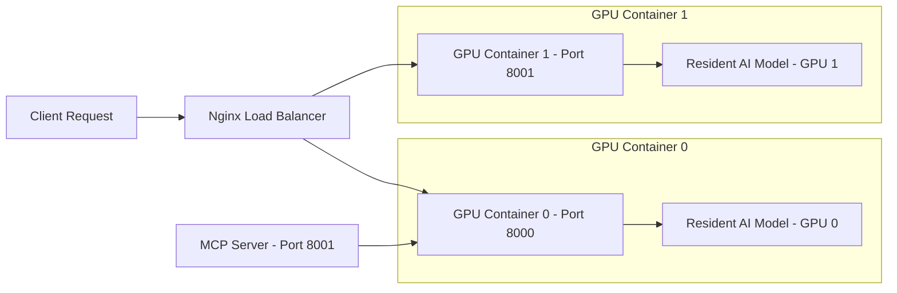

# MolE: Antimicrobial Potential Prediction System

## Project Introduction
This tool uses advanced AI to predict if a chemical molecule has the potential to kill bacteria. Think of it like a **spellchecker, but for potential antibiotics**.

- **Input**: A SMILES string (text representation of a molecule).
- **Output**: Probability scores and "Yes/No" inhibition predictions.

## System Architecture
The system supports both single-GPU and multi-GPU deployments. By default, it uses two API containers with Nginx load balancing for high availability and parallel inference.



## Multi-GPU Configuration

Each API container is bound to a specific GPU via `GPU_IDS` environment variable:

| Container | GPU | Port |
|-----------|-----|------|
| mole_api_0 | GPU 0 | 8000 |
| mole_api_1 | GPU 1 | 8001 |
| mole_lb | - | 8080 (nginx) |
| mole_mcp | GPU 0 | 8001 |

## Configuration & Performance Tuning

- **`MODEL_LOAD_MODE`**
  - `resident` (Default): Models load once at startup and stay in VRAM. Fast inference (milliseconds) but higher constant VRAM usage.
  - `on_demand`: Models load/unload per request. Saves VRAM but slower inference (seconds).

- **`MAX_CONCURRENT_REQUESTS`** (Default: `2`)
  - Controls parallel predictions per GPU container. Prevents GPU OOM errors.

- **`GPU_IDS`**
  - Specifies which GPU to use (e.g., `0`, `1`, or `0,1`).
  - Avoids conflict with nvidia runtime.

## Quick Start

```bash
# Start all services (2 GPU containers + nginx + mcp)
docker-compose up -d

# Or start single GPU only
docker-compose up -d mole_api_0

# Check health via nginx load balancer
curl localhost:8080/health

# Or check specific GPU container
curl localhost:8000/health
curl localhost:8001/health
```

## API Endpoints

- **Health Check**: `GET /health`
- **Prediction**: `POST /predict`
