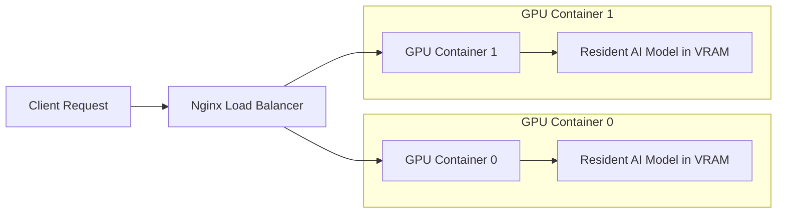

# MolE: Antimicrobial Potential Prediction System

## Project Introduction
This tool uses advanced AI to predict if a chemical molecule has the potential to kill bacteria. Think of it like a **spellchecker, but for potential antibiotics**.

- **Input**: A SMILES string (text representation of a molecule).
- **Output**: Probability scores and "Yes/No" inhibition predictions.

## System Architecture
The system utilizes a high-performance, multi-GPU setup with Nginx load balancing to ensure fast and reliable inference.



## Configuration & Performance Tuning
The following environment variables control the system's performance and resource usage:

- **`MODEL_LOAD_MODE`**
  - `resident` (Default): Models load once at startup and stay in VRAM. This ensures fast inference (milliseconds) but requires higher constant VRAM usage.
  - `on_demand`: Models load and unload for every individual request. This saves VRAM but results in much slower inference (seconds).

- **`MAX_CONCURRENT_REQUESTS`** (Default: `2`)
  - Controls the number of parallel predictions allowed per GPU container. This is critical for preventing GPU Out-Of-Memory (OOM) errors under load.

- **`WORKERS_API`** (Default: `1`)
  - The number of Gunicorn workers. Keep this low (1) when using GPUs to avoid VRAM contention between multiple worker processes.

## Quick Start

1. **Start the services:**
   ```bash
   docker-compose up -d --build
   ```

2. **Check system health:**
   ```bash
   curl localhost:8000/health
   ```
