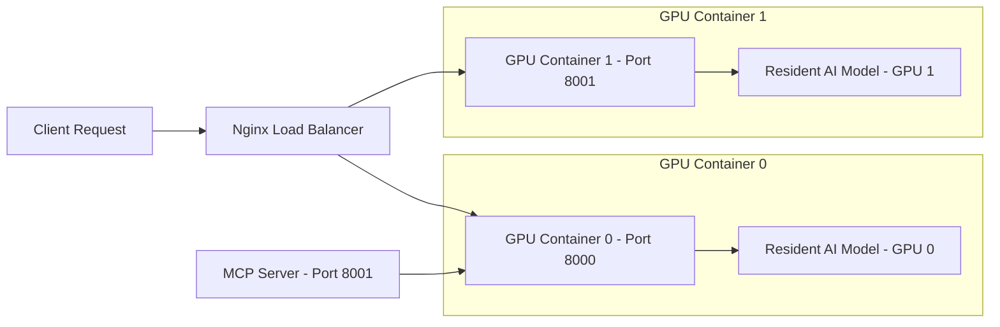

# MolE: Antimicrobial Potential Prediction System

## Project Introduction
This tool uses advanced AI to predict if a chemical molecule has the potential to kill bacteria. Think of it like a **spellchecker, but for potential antibiotics**.

- **Input**: A SMILES string (text representation of a molecule).
- **Output**: Probability scores and "Yes/No" inhibition predictions.

## System Architecture
The system supports both single-GPU and multi-GPU deployments. By default, it uses two API containers with Nginx load balancing for high availability and parallel inference.



## Multi-GPU Configuration

For the legacy container deployment path, each API container can be bound to a
specific GPU via `GPU_IDS`:

| Container | GPU | Port |
|-----------|-----|------|
| mole_api_0 | GPU 0 | 8000 |
| mole_api_1 | GPU 1 | 8001 |
| mole_lb | - | 8080 (nginx) |
| mole_mcp | GPU 0 | 8001 |

## Legacy Container Tuning

The variables in this section apply to the older container-oriented API launch
path. They are not the primary tuning knobs for `pixi run mole predict` or
`pixi run mole screen`, which are documented in the CLI sections below.

- **`MODEL_LOAD_MODE`**
  - `resident` (Default): Models load once at startup and stay in VRAM. Fast inference (milliseconds) but higher constant VRAM usage.
  - `on_demand`: Models load/unload per request. Saves VRAM but slower inference (seconds).

- **`MAX_CONCURRENT_REQUESTS`** (Default: `2`)
  - Controls parallel predictions per GPU container. Prevents GPU OOM errors.

- **`GPU_IDS`**
  - Specifies which GPU to use (e.g., `0`, `1`, or `0,1`).
  - Avoids conflict with nvidia runtime.

## Quick Start

```bash
# Start all services (2 GPU containers + nginx + mcp)
docker-compose up -d

# Or start single GPU only
docker-compose up -d mole_api_0

# Check health via nginx load balancer
curl localhost:8080/health

# Or check specific GPU container
curl localhost:8000/health
curl localhost:8001/health
```

## Pixi CLI

The repository now also ships a unified `mole` CLI for local workflows and agents.
It uses the same predictor and single-GPU adaptive scheduler singleton as the HTTP
servers and can run with `pixi` on a fresh machine.

### Performance and Multi-GPU Guidance
A single `mole screen` or `api_server.py` instance uses one GPU consumer mapped to
multiple dynamically allocated CPU worker processes or threads to parse, chunk, and
normalize large tabular buffers and Tar/SQLite files seamlessly. Batch sizes are
automatically tuned based on available VRAM to keep the GPU busy. Grouping and chunking
split size are also dynamically estimated based on hardware capabilities rather than static numbers.

The recommended deployment for multiple GPUs is manual: start multiple independent processes and
pin each one with `CUDA_VISIBLE_DEVICES` (e.g., `CUDA_VISIBLE_DEVICES=0 pixi run mole screen ...`).
Same-GPU multi-processing is not recommended as it duplicates model weights.

For large multi-source screening on a single GPU, `mole screen --execution-mode process`
now uses one predictor process per GPU plus multiple CPU producer processes. In this mode,
the CLI first preprocesses repeated `--input-path` CSV/TSV inputs into Parquet shards and
then persists only broad-spectrum hits plus resumable batch manifests.

### Parameter Summary

Commonly used command families and their tuning surface:

- `mole doctor`
  - validation only: `--strict-gpu`, `--env-file`, `--scaffold-file`,
    `--objective-file`
  - use it to validate CUDA, model files, and REINVENT4 assets before a run
- `mole predict`
  - result/content: `--classifier-backend`, `--aggregate-scores`,
    `--app-threshold`, `--min-nkill`
  - performance/reproducibility: `--num-graph-workers`,
    `--graph-batch-size`, `--prefetch-batches`, `--profiling`,
    `--deterministic-representation`
- `mole benchmark-screening-inputs`
  - `--input-path`, `--output`
  - lightweight input-path inspection for comparing candidate screening sources
- `scripts/benchmark_classifier_workers.py`
  - non-CLI benchmark helper for sweeping `classifier_workers` in `predictor`
    or `stream` mode on the current machine
- `mole screen`
  - mode/content: `--execution-mode`, `--archive-pattern`,
    `--archive-smiles-colname`, `--archive-chem-id-colname`,
    `--sqlite-table`, `--sqlite-query`, `--no-dedupe-smiles`,
    `--aggregate-scores`, `--per-strain`, `--app-threshold`,
    `--min-nkill`
  - throughput/scheduling: `--grouping-mode`, `--cpu-workers`,
    `--producer-processes`, `--predict-queue-max-batches`,
    `--result-queue-max-batches`, `--batch-checkpoint-size`,
    `--rows-per-shard`, `--row-group-size`,
    `--target-rows-per-group`, `--target-bytes-per-group`,
    `--input-chunk-size`, `--max-batch-size`,
    `--target-gpu-memory-fraction`, `--prefetch-queue-size`,
    `--prediction-row-budget`, `--num-graph-workers`,
    `--graph-batch-size`, `--prefetch-batches`, `--profiling`,
    `--deterministic-representation`
- `mole stream-enumeration-screen`
  - scaffold/content: `--scaffold-file`, `--scaffold-dir`,
    `--scaffold-catalog`, `--ordinary-library`, `--pos13-library`,
    `--start-index`, `--stop-index`, `--app-threshold`, `--min-nkill`
  - resume/output: `--output-dir`, `--run-state`, `--chunk-manifest`
  - throughput/scheduling: `--shard-size`, `--prediction-batch-size`,
    `--classifier-backend`, `--num-graph-workers`, `--graph-batch-size`,
    `--prefetch-batches`, `--classifier-workers`,
    `--classifier-inflight-batches`, `--profiling`,
    `--deterministic-representation`
- `mole preprocess-screening-input`
  - `--input-path`, `--output-dir`, `--smiles-colname`,
    `--chem-id-colname`, `--source-group`, `--rows-per-shard`,
    `--row-group-size`, `--output`

Detailed parameter semantics live in:

- [docs/cli_reference.md](docs/cli_reference.md)
- [docs/batch_screening_input_format.md](docs/batch_screening_input_format.md)
- [docs/process_screening.md](docs/process_screening.md)
- [docs/stream_enumeration_screen_runbook.md](docs/stream_enumeration_screen_runbook.md)
- [docs/prediction_optimization_plan.md](docs/prediction_optimization_plan.md)
- [docs/repo_layout.md](docs/repo_layout.md)
- [data/04.new_predictions/README.md](data/04.new_predictions/README.md)

### Result vs. Performance Knobs

These settings can change which molecules are loaded, how duplicates are
collapsed, which backend or model is used, or what output shape is emitted. They
can therefore change result content:

- `--classifier-backend`
- `--execution-mode`
- `--archive-pattern`
- `--archive-smiles-colname`
- `--archive-chem-id-colname`
- `--sqlite-table`
- `--sqlite-query`
- `--no-dedupe-smiles`
- `--aggregate-scores` / `--per-strain`
- `--app-threshold`
- `--min-nkill`
- `MOLE_CLASSIFIER_BACKEND`
- `MOLE_MOLE_MODEL_PATH`
- `MOLE_PICKLE_MODEL_PATH`
- `MOLE_TIMBER_MODEL_DIR`

These settings are intended to change throughput, memory pressure, scheduling,
or device placement. For a fixed model/backend they should not change the
semantic prediction path:

- `--num-graph-workers`
- `--graph-batch-size`
- `--prefetch-batches`
- `--grouping-mode`
- `--cpu-workers`
- `--producer-processes`
- `--predict-queue-max-batches`
- `--result-queue-max-batches`
- `--batch-checkpoint-size`
- `--rows-per-shard`
- `--row-group-size`
- `--target-rows-per-group`
- `--target-bytes-per-group`
- `--input-chunk-size`
- `--max-batch-size`
- `--target-gpu-memory-fraction`
- `--prefetch-queue-size`
- `--prediction-row-budget`
- `--profiling`
- `CUDA_VISIBLE_DEVICES`
- `MOLE_TORCH_VERSION`
- `MOLE_TORCH_CUDA_TAG`
- `MOLE_TORCH_INDEX_URL`

`--deterministic-representation` is a reproducibility knob. It keeps the same
model semantics but can change low-level CUDA execution choices and slow down
throughput.

### `num_graph_workers=0`

`num_graph_workers` controls the MolE pre-forward CPU graph path:

`SMILES -> RDKit molecule -> graph features -> PyG DataLoader batch`

It does not disable graph construction. It only controls whether extra
DataLoader workers are used:

- `--num-graph-workers 0`
  - disable extra graph workers
  - build graphs synchronously in the main process
- `--num-graph-workers auto|N>0`
  - use additional workers and prefetch to overlap graph preparation with later
    stages

This setting should not change prediction semantics for a fixed model and
backend. It only changes throughput and CPU resource contention. On the current
2080 Ti host, `--num-graph-workers 0` benchmarked faster than worker
auto-selection.

```bash
# Install the local environment
pixi install

# Install a CUDA-enabled PyTorch wheel into the active Pixi env
pixi run install-cuda-torch

# Override the CUDA wheel when moving to a different NVIDIA/CUDA stack
MOLE_TORCH_CUDA_TAG=cu124 MOLE_TORCH_VERSION=2.5.1+cu124 pixi run install-cuda-torch

# Check the environment, CUDA, model paths, Timber backend, and REINVENT4 assets
pixi run mole doctor

# Generate MolE embeddings from raw SMILES
pixi run mole embed --smiles CCO

# Predict strain-level antimicrobial probabilities
pixi run mole predict --smiles CCO

# Batch screen a CSV/TSV file, Parquet source, tar archive, or SQLite database
pixi run mole screen \
  --input-path data/04.new_predictions/2026-04-21_screening/macro_split_ring16_scheme_b_fix_pos13_per_scaffold_2026-04-21.tar.gz \
  --output-dir data/04.new_predictions/2026-04-21_screening/runs/demo \
  --max-batch-size 16384 \
  --target-gpu-memory-fraction 0.8 \
  --input-chunk-size 10000 \
  --prefetch-queue-size 4

# Preferred high-throughput path: preprocess large CSV/TSV inputs into Parquet shards
pixi run mole preprocess-screening-input \
  --input-path data/04.new_predictions/raw/input.csv \
  --output-dir data/04.new_predictions/prepared \
  --smiles-colname smiles \
  --chem-id-colname chem_id \
  --source-group batch_a \
  --rows-per-shard 100000 \
  --row-group-size 4000

# Then screen the prepared Parquet file or shard directory
pixi run mole screen \
  --input-path data/04.new_predictions/prepared/batch_a \
  --output-dir data/04.new_predictions/runs/batch_a \
  --classifier-backend pickle \
  --num-graph-workers 0 \
  --graph-batch-size 1024 \
  --prediction-row-budget 8192 \
  --profiling

# Or screen multiple CSV/TSV sources in process mode with hit-only persistence
pixi run mole screen \
  --input-path data/04.new_predictions/raw/tylosin.csv \
  --input-path data/04.new_predictions/raw/tilmicosin.csv \
  --output-dir data/04.new_predictions/runs/process_batch \
  --execution-mode process \
  --classifier-backend pickle \
  --producer-processes auto \
  --batch-checkpoint-size 2048

# Process mode writes prepared manifests, batch_manifest.jsonl, run_state.json, and hits/...
# It does not write predictions_all.tsv for non-hit molecules.

# Stream scaffold/fragment combinations directly and persist only broad-spectrum hits
pixi run mole stream-enumeration-screen \
  --output-dir data/05.stream_tasks/smoke_runs/demo \
  --run-state data/05.stream_tasks/thought2_stream_screen_2026-04-23/thought2_stream_screen_2026-04-23/run_state.json \
  --ordinary-library data/05.stream_tasks/thought2_stream_screen_2026-04-23/thought2_stream_screen_2026-04-23/validation_output/thought2_enumeration/input_libraries/shared_ordinary_library.csv \
  --pos13-library data/05.stream_tasks/thought2_stream_screen_2026-04-23/thought2_stream_screen_2026-04-23/validation_output/thought2_enumeration/input_libraries/pos13_sugar_library.csv \
  --chunk-manifest data/05.stream_tasks/thought2_stream_screen_2026-04-23/thought2_stream_screen_2026-04-23/validation_output/thought2_enumeration/chunk_manifest.csv \
  --stop-index 100000 \
  --shard-size 20000 \
  --prediction-batch-size 512 \
  --classifier-backend pickle \
  --num-graph-workers 0

# Sweep classifier_workers before overriding auto on a new machine
pixi run python scripts/benchmark_classifier_workers.py \
  --mode predictor \
  --ordinary-library data/05.stream_tasks/thought2_stream_screen_2026-04-23/thought2_stream_screen_2026-04-23/validation_output/thought2_enumeration/input_libraries/shared_ordinary_library.csv \
  --pos13-library data/05.stream_tasks/thought2_stream_screen_2026-04-23/thought2_stream_screen_2026-04-23/validation_output/thought2_enumeration/input_libraries/pos13_sugar_library.csv \
  --workers 1 2 4 6 8 12 \
  --sample-size 8192 \
  --repeats 3 \
  --classifier-backend pickle \
  --num-graph-workers 0 \
  --output data/05.stream_tasks/benchmarks/classifier_workers/predictor_sample8192.json

# Compute REINVENT4 rewards
pixi run mole score \
  --objective-file workflows/reinvent4/inputs/objectives/pathogen_group_a.site_reward.prototype.json \
  --smiles CCO

# Run the chunked REINVENT4 optimizer wrapper
pixi run mole optimize \
  --template workflows/reinvent4/configs/templates/multi_strain_rl_macrocycle.toml.tpl \
  --env-file workflows/reinvent4/configs/local.env.recommended.example \
  --experiment-spec workflows/reinvent4/configs/long_runs/pathogen_group_a.json \
  --scaffold-file workflows/reinvent4/inputs/scaffolds/mother_scaffold.template.smi
```

Notes:

- `mole score` automatically fills `site_reward.scaffold_smiles` from
  `--scaffold-file` when the objective enables `site_reward` but does not embed
  a scaffold.
- For high-throughput batch screening, do not treat raw `tar.gz` bundles or a
  single huge CSV as the preferred execution format. Preprocess them into
  Parquet shards first. See
  [docs/batch_screening_input_format.md](docs/batch_screening_input_format.md).
- `mole screen` accepts CSV/TSV files, Parquet files, Parquet shard
  directories, tar archive bundles, or SQLite
  databases. It will intelligently group batches based on available CPU/RAM, mapping
  items dynamically without relying on fixed scaffold sizes or arbitrary constants.
  It auto-fills missing `chem_id` values, evaluates chunks efficiently, writes a
  total summary table first, and also writes per-source grouped results under `by_source/`.
- `classifier_workers=auto` is backend-aware. For `pickle`, it resolves from
  the effective CPU quota with a conservative cap. For `timber`, it stays at
  `1` until concurrent native safety is explicitly validated.
- The default classifier backend is `auto`; it prefers the original
  pickle/XGBoost model when available and falls back to Timber only when the
  pickle model is missing. This keeps results aligned with the original MolE
  prediction path and is faster for high-throughput local screening.
- `pixi run install-cuda-torch` installs a CUDA-enabled PyTorch wheel into the
  active Pixi environment. Use `MOLE_TORCH_CUDA_TAG` and `MOLE_TORCH_VERSION`
  to switch CUDA wheels when moving to another NVIDIA GPU machine.
- You can override the MolE checkpoint path with `MOLE_MOLE_MODEL_PATH`.
- You can override the pickle/XGBoost model path with
  `MOLE_PICKLE_MODEL_PATH`.
- You can override the Timber compiled model directory with
  `MOLE_TIMBER_MODEL_DIR`.
- You can force the classifier backend with `--classifier-backend timber`,
  `--classifier-backend pickle`, `MOLE_CLASSIFIER_BACKEND=timber`, or
  `MOLE_CLASSIFIER_BACKEND=pickle`.

## Runtime Environment Variables

These are the runtime variables worth knowing when moving across machines or
pinning processes to specific GPUs:

| Variable | Purpose | Result impact |
| --- | --- | --- |
| `MOLE_CLASSIFIER_BACKEND` | Backend preference: `auto`, `pickle`, `timber` | Can change result content |
| `MOLE_MOLE_MODEL_PATH` | Override MolE checkpoint directory | Can change result content |
| `MOLE_PICKLE_MODEL_PATH` | Override pickle/XGBoost model path | Can change result content |
| `MOLE_TIMBER_MODEL_DIR` | Override Timber compiled model directory | Can change result content |
| `CUDA_VISIBLE_DEVICES` | Bind the process to one or more visible GPUs | Performance/device only |
| `MOLE_TORCH_VERSION` | Wheel version used by `pixi run install-cuda-torch` | Install/runtime only |
| `MOLE_TORCH_CUDA_TAG` | CUDA wheel tag used by `pixi run install-cuda-torch` | Install/runtime only |
| `MOLE_TORCH_INDEX_URL` | Custom PyTorch wheel index URL | Install/runtime only |

For the complete batch screening parameter handbook, read
[docs/batch_screening_input_format.md](docs/batch_screening_input_format.md).

For the complete CLI parameter reference across all `mole` subcommands, read
[docs/cli_reference.md](docs/cli_reference.md).

## Change Index

- [2026-04-21 subagent review fixes](docs/changes/2026-04-21-subagent-review-fixes.md)
  - Timber auto-backend fallback hardening
  - Repo-root-relative default pickle path
  - Duplicate `chem_id` validation in `/score`

## Repository Layout

For a concise map from feature area to Python file, see:

- [docs/repo_layout.md](docs/repo_layout.md)
- [docs/batch_screening_input_format.md](docs/batch_screening_input_format.md)
- `src/prediction_scheduler.py`: Adaptive single-GPU batch scheduler
- `src/screening_sources.py`: Streaming archive and tabular input loaders

That document is the canonical reference for where the current entrypoints,
legacy scripts, and workflow helpers live.

## API Endpoints

- **Health Check**: `GET /health`
- **Prediction**: `POST /predict`
