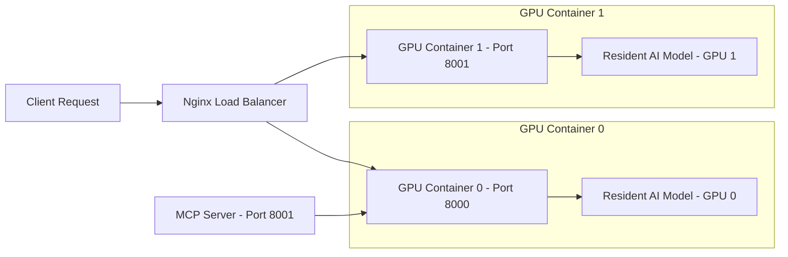

# MolE: Antimicrobial Potential Prediction System

## Project Introduction
This tool uses advanced AI to predict if a chemical molecule has the potential to kill bacteria. Think of it like a **spellchecker, but for potential antibiotics**.

- **Input**: A SMILES string (text representation of a molecule).
- **Output**: Probability scores and "Yes/No" inhibition predictions.

## System Architecture
The system supports both single-GPU and multi-GPU deployments. By default, it uses two API containers with Nginx load balancing for high availability and parallel inference.



## Multi-GPU Configuration

Each API container is bound to a specific GPU via `GPU_IDS` environment variable:

| Container | GPU | Port |
|-----------|-----|------|
| mole_api_0 | GPU 0 | 8000 |
| mole_api_1 | GPU 1 | 8001 |
| mole_lb | - | 8080 (nginx) |
| mole_mcp | GPU 0 | 8001 |

## Configuration & Performance Tuning

- **`MODEL_LOAD_MODE`**
  - `resident` (Default): Models load once at startup and stay in VRAM. Fast inference (milliseconds) but higher constant VRAM usage.
  - `on_demand`: Models load/unload per request. Saves VRAM but slower inference (seconds).

- **`MAX_CONCURRENT_REQUESTS`** (Default: `2`)
  - Controls parallel predictions per GPU container. Prevents GPU OOM errors.

- **`GPU_IDS`**
  - Specifies which GPU to use (e.g., `0`, `1`, or `0,1`).
  - Avoids conflict with nvidia runtime.

## Quick Start

```bash
# Start all services (2 GPU containers + nginx + mcp)
docker-compose up -d

# Or start single GPU only
docker-compose up -d mole_api_0

# Check health via nginx load balancer
curl localhost:8080/health

# Or check specific GPU container
curl localhost:8000/health
curl localhost:8001/health
```

## Pixi CLI

The repository now also ships a unified `mole` CLI for local workflows and agents.
It uses the same predictor singleton as the HTTP servers and can run with `pixi`
on a fresh machine.

```bash
# Install the local environment
pixi install

# Check the environment, CUDA, model paths, Timber backend, and REINVENT4 assets
pixi run mole doctor

# Generate MolE embeddings from raw SMILES
pixi run mole embed --smiles CCO

# Predict strain-level antimicrobial probabilities
pixi run mole predict --smiles CCO

# Batch screen a CSV/TSV file or tar archive for broad-spectrum candidates
pixi run mole screen \
  --input-path data/04.new_predictions/2026-04-21_screening/macro_split_ring16_scheme_b_fix_pos13_per_scaffold_2026-04-21.tar.gz \
  --output-dir data/04.new_predictions/2026-04-21_screening/runs/demo

# Compute REINVENT4 rewards
pixi run mole score \
  --objective-file workflows/reinvent4/inputs/objectives/pathogen_group_a.site_reward.prototype.json \
  --smiles CCO

# Run the chunked REINVENT4 optimizer wrapper
pixi run mole optimize \
  --template workflows/reinvent4/configs/templates/multi_strain_rl_macrocycle.toml.tpl \
  --env-file workflows/reinvent4/configs/local.env.recommended.example \
  --experiment-spec workflows/reinvent4/configs/long_runs/pathogen_group_a.json \
  --scaffold-file workflows/reinvent4/inputs/scaffolds/mother_scaffold.template.smi
```

Notes:

- `mole score` automatically fills `site_reward.scaffold_smiles` from
  `--scaffold-file` when the objective enables `site_reward` but does not embed
  a scaffold.
- `mole screen` accepts CSV/TSV files, tar archive bundles, or SQLite
  databases, auto-fills missing `chem_id` values, writes a total summary table
  first, and also writes per-source grouped results under `by_source/`.
- The default classifier backend is `auto`; Timber is used when the compiled
  artifact is available, otherwise the original pickle backend is used.
- You can override the MolE checkpoint path with `MOLE_MOLE_MODEL_PATH`.
- You can force the classifier backend with `MOLE_CLASSIFIER_BACKEND=timber`
  or `MOLE_CLASSIFIER_BACKEND=pickle`.

## Change Index

- [2026-04-21 subagent review fixes](docs/changes/2026-04-21-subagent-review-fixes.md)
  - Timber auto-backend fallback hardening
  - Repo-root-relative default pickle path
  - Duplicate `chem_id` validation in `/score`

## Repository Layout

For a concise map from feature area to Python file, see:

- [docs/repo_layout.md](docs/repo_layout.md)

That document is the canonical reference for where the current entrypoints,
legacy scripts, and workflow helpers live.

## API Endpoints

- **Health Check**: `GET /health`
- **Prediction**: `POST /predict`
