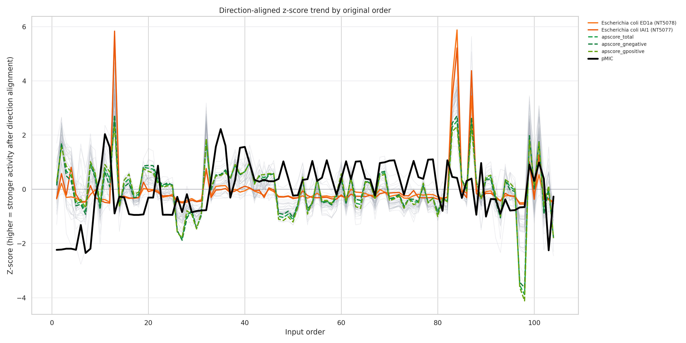
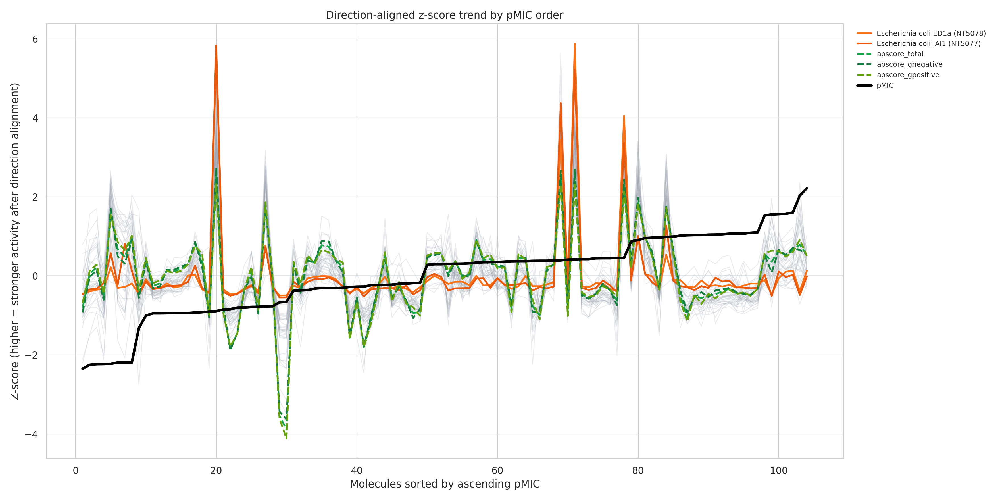
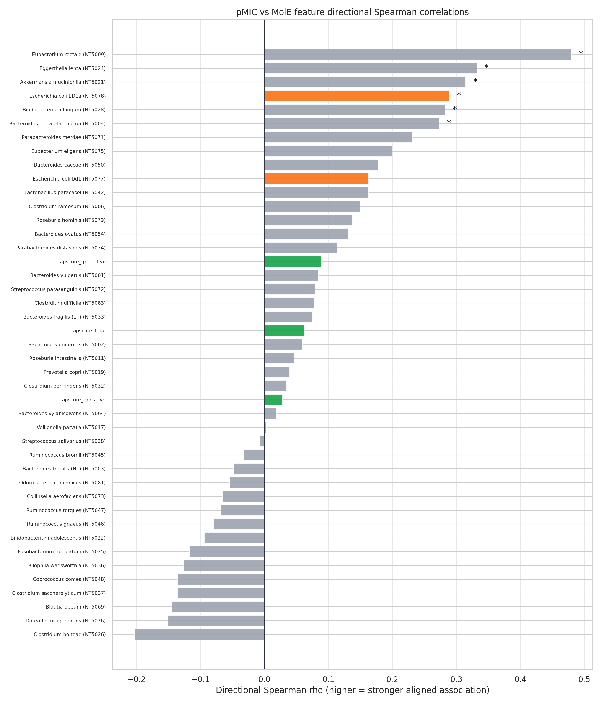
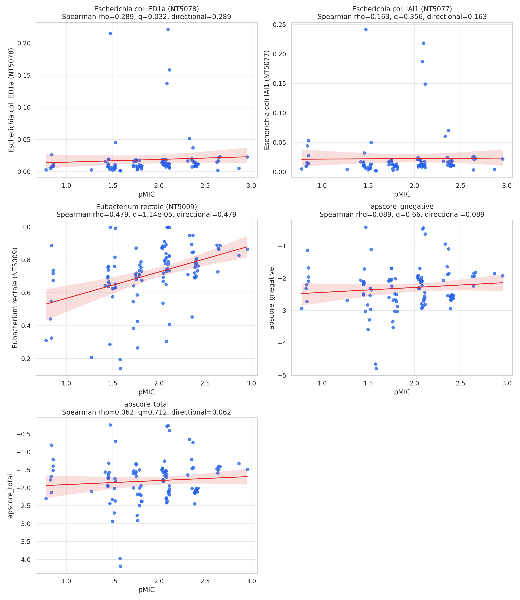
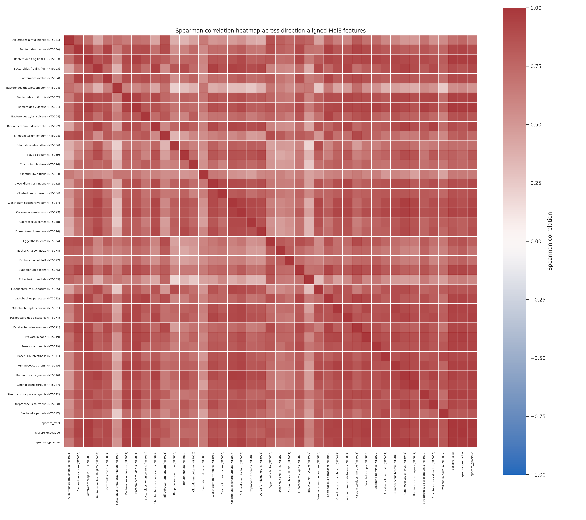

# QSAR-104 MolE/pMIC 相关性分析报告

## 实验目的

本实验评估 `QSAR-104-SMILES.xlsx` 中 104 个具有同类特定母核/结构系列的 SMILES，使用 MolE + XGBoost 对 40 个 Maier 菌株进行抗菌活性预测后，预测结果是否与真实 E. coli `pMIC` 活性值存在相关趋势。

本实验回答两个问题：

1. MolE 的 40 个单菌株预测概率和 3 个聚合 `apscore_*` 是否与真实 `pMIC` 有统计相关性。
2. 这套 MolE 输出能否作为后续同一类母核 SMILES 的广谱抗菌活性筛选依据。

## 实验数据与输出定义

- 输入文件：`data/09.qsar_smiles/QSAR-104-SMILES.xlsx`
- 分子数量：104
- 输入字段：`SMILES`、`name`、`pMIC`
- pMIC 范围：0.78 到 2.955
- MolE 菌株数量：40
- E. coli 菌株数量：2
- E. coli 菌株：`Escherichia coli ED1a (NT5078)`、`Escherichia coli IAI1 (NT5077)`

## 单菌株预测值与 apscore 如何处理

单个菌株的预测活性结果来自 `antimicrobial_predictive_probability`，是 0 到 1 之间的概率值。它表示模型预测该分子对该菌株产生生长抑制/抗菌效应的概率。主矩阵中 40 个菌株列保存的就是这个概率，未二值化。

`apscore_total`、`apscore_gnegative`、`apscore_gpositive` 是在这些概率基础上计算的 log 几何均值：

```text
apscore_total = mean(log(40 个菌株概率))
apscore_gnegative = mean(log(革兰氏阴性菌株概率))
apscore_gpositive = mean(log(革兰氏阳性菌株概率))
```

因为概率位于 0 到 1，`log(probability)` 通常是负值，所以 `apscore_*` 常见为负数。本次数据中：

| feature | n | mean | std | min | median | max |
| --- | --- | --- | --- | --- | --- | --- |
| pMIC | 104 | 1.898 | 0.4781 | 0.78 | 2.042 | 2.955 |
| apscore_total | 104 | -1.809 | 0.6151 | -4.189 | -1.759 | -0.2446 |
| apscore_gnegative | 104 | -2.305 | 0.6883 | -4.792 | -2.301 | -0.4244 |
| apscore_gpositive | 104 | -1.403 | 0.5596 | -3.696 | -1.334 | -0.09746 |

严格按当前代码公式解释，`apscore_*` 越接近 0，表示对应菌株集合的几何平均预测概率越高；越负表示几何平均预测概率越低。报告和图表保留原始 `apscore_*`，不再对其取负。

## 实验方案

1. 使用当前项目的 `src.service.get_predictor()` 加载 MolE 表征模型和 MolE-XGBoost 分类器，不修改核心预测代码。
2. 对 104 个 SMILES 逐批生成 MolE 表征，并对 40 个菌株输出 `antimicrobial_predictive_probability`。
3. 构建 44 列主矩阵：`pMIC + 40 个菌株预测概率 + 3 个 apscore`。
4. 对 43 个 MolE 特征分别计算 Pearson、Spearman、Kendall 相关性。
5. 对每类相关性 p-value 进行 Benjamini-Hochberg FDR 校正。
6. 对 Pearson 和 Spearman 相关系数进行 bootstrap 95% CI 估计。
7. 绘制趋势图、pMIC 排序趋势图、Spearman 条形图、关键散点图和 MolE 特征相关热图。

## 实验过程

运行命令：

```bash
pixi run python scripts/analyze_qsar104_mole_correlation.py
```

输出目录：

```text
data/09.qsar_smiles/analysis/
```

运行参数摘要：

- bootstrap iterations：1000
- bootstrap seed：20260424
- app_threshold：0.04374140128493309
- min_nkill：10
- n_molecules：104
- n_strains：40
- n_mole_features：43

## 结果目录文件说明

| 文件 | 作用 |
| --- | --- |
| `EXPERIMENT_REPORT.md` | 本报告文件。汇总实验目的、流程、图表解释、严格结论和后续使用建议。 |
| `qsar104_mole_prediction_matrix.csv` | 主数据矩阵，104 行 x 44 列；第 1 列为 pMIC，第 2-41 列为 40 个菌株预测概率，第 42-44 列为 apscore_total/apscore_gnegative/apscore_gpositive。 |
| `qsar104_mole_prediction_matrix_with_metadata.csv` | 带元数据矩阵，104 行 x 48 列；比主矩阵多 input_order、chem_id、name、SMILES，便于追踪原始分子。 |
| `qsar104_pmic_correlations.csv` | 43 个 MolE 特征与 pMIC 的相关性统计表；包含 Pearson、Spearman、Kendall、FDR q-value、bootstrap 95% CI、E. coli 标记和方向排名。 |
| `qsar104_ecoli_correlations.csv` | 只包含两个 E. coli 菌株的相关性统计，用于专项判断真实 E. coli pMIC 与 MolE E. coli 输出是否一致。 |
| `qsar104_feature_summary.csv` | pMIC、40 个菌株概率和 3 个 apscore 的分布统计，包括均值、标准差、分位数、最小值和最大值。 |
| `qsar104_analysis_manifest.json` | 分析运行清单，记录输入路径、输出路径、参数、样本数、菌株数和 Top10 directional Spearman 摘要。 |
| `qsar104_trend_original_order_aligned_zscore.png` | 原始 Excel 顺序下的 z-score 趋势图；用于检查是否有明显批次/排序效应。 |
| `qsar104_trend_pmic_sorted_aligned_zscore.png` | 按 pMIC 从低到高排序后的 z-score 趋势图；用于观察 MolE 曲线是否随真实活性增强而整体上升。 |
| `qsar104_spearman_correlation_barplot.png` | 43 个 MolE 特征与 pMIC 的 directional Spearman 条形图；用于判断哪些菌株/聚合分数与 pMIC 趋势最接近。 |
| `qsar104_key_scatterplots.png` | 关键特征散点/回归图；包括两个 E. coli、Top 特征和 apscore 聚合分数。 |
| `qsar104_mole_feature_spearman_heatmap.png` | 43 个 MolE 特征之间的 Spearman 相关热图；用于判断 MolE 输出之间是否高度冗余。 |

## 主要统计结果

按 directional Spearman 排序的前 10 个 MolE 特征如下：

| rank_by_directional_spearman | feature | feature_type | gram_group | is_ecoli | pearson_r | pearson_q | spearman_rho | spearman_q | spearman_ci95_low | spearman_ci95_high |
| --- | --- | --- | --- | --- | --- | --- | --- | --- | --- | --- |
| 1 | Eubacterium rectale (NT5009) | strain_probability | positive | False | 0.4195 | 0.0003995 | 0.4792 | 1.142e-05 | 0.312 | 0.6192 |
| 2 | Eggerthella lenta (NT5024) | strain_probability | positive | False | 0.2412 | 0.1957 | 0.3319 | 0.01241 | 0.1561 | 0.4907 |
| 3 | Akkermansia muciniphila (NT5021) | strain_probability | negative | False | 0.1812 | 0.4702 | 0.3143 | 0.01658 | 0.1213 | 0.4785 |
| 4 | Escherichia coli ED1a (NT5078) | strain_probability | negative | True | 0.05893 | 0.819 | 0.2885 | 0.03198 | 0.08966 | 0.463 |
| 5 | Bifidobacterium longum (NT5028) | strain_probability | positive | False | 0.4062 | 0.0004039 | 0.282 | 0.03202 | 0.08415 | 0.4535 |
| 6 | Bacteroides thetaiotaomicron (NT5004) | strain_probability | negative | False | 0.1343 | 0.5806 | 0.2728 | 0.03637 | 0.07908 | 0.4538 |
| 7 | Parabacteroides merdae (NT5071) | strain_probability | negative | False | 0.1972 | 0.385 | 0.231 | 0.1123 | 0.02932 | 0.4082 |
| 8 | Eubacterium eligens (NT5075) | strain_probability | positive | False | 0.2076 | 0.3704 | 0.1993 | 0.2032 | 0.01359 | 0.3718 |
| 9 | Bacteroides caccae (NT5050) | strain_probability | negative | False | 0.1432 | 0.5806 | 0.1776 | 0.3065 | -0.01484 | 0.3577 |
| 10 | Escherichia coli IAI1 (NT5077) | strain_probability | negative | True | 0.01164 | 0.9758 | 0.1627 | 0.3561 | -0.0407 | 0.364 |

FDR 校正后显著性数量：

- Pearson q < 0.05：2 / 43
- Spearman q < 0.05：6 / 43
- Kendall q < 0.05：5 / 43

三个聚合分数与 pMIC 的相关性如下：

| feature | pearson_r | pearson_q | spearman_rho | spearman_q | spearman_ci95_low | spearman_ci95_high | rank_by_directional_spearman |
| --- | --- | --- | --- | --- | --- | --- | --- |
| apscore_gnegative | 0.1063 | 0.698 | 0.0891 | 0.6601 | -0.1139 | 0.2637 | 16 |
| apscore_total | 0.08819 | 0.698 | 0.06235 | 0.7115 | -0.1354 | 0.2534 | 21 |
| apscore_gpositive | 0.06927 | 0.7817 | 0.02808 | 0.8355 | -0.1719 | 0.2173 | 26 |

两个 E. coli 菌株专项结果如下：

| feature | pearson_r | pearson_q | pearson_ci95_low | pearson_ci95_high | spearman_rho | spearman_q | spearman_ci95_low | spearman_ci95_high | rank_by_directional_spearman |
| --- | --- | --- | --- | --- | --- | --- | --- | --- | --- |
| Escherichia coli ED1a (NT5078) | 0.05893 | 0.819 | -0.08396 | 0.2003 | 0.2885 | 0.03198 | 0.08966 | 0.463 | 4 |
| Escherichia coli IAI1 (NT5077) | 0.01164 | 0.9758 | -0.1195 | 0.1588 | 0.1627 | 0.3561 | -0.0407 | 0.364 | 10 |

## “有一定相关性但不强”的严格依据

这个结论不是来自单一图形印象，而是来自统计表和图形的组合证据：

1. 43 个 MolE 特征中，只有 6 个特征在 Spearman FDR 校正后达到 q < 0.05。说明不是整体所有 MolE 输出都与 pMIC 强相关，而是少数菌株概率具有可检测的单调趋势。
2. 最强相关特征是 `Eubacterium rectale (NT5009)`，Spearman rho = 0.4792。这属于中等相关，不是强相关。通常强相关应接近 0.7 或更高，本实验没有达到这一水平。
3. 与真实 E. coli pMIC 最直接相关的 `Escherichia coli ED1a (NT5078)` 排名第 4，Spearman rho = 0.2885，q = 0.03198，属于弱到中等单调相关。
4. 另一个 E. coli 菌株 `Escherichia coli IAI1 (NT5077)` Spearman rho = 0.1627，q = 0.3561，FDR 后不显著。
5. 两个 E. coli 的 Pearson 相关都很弱：ED1a Pearson r = 0.05893，IAI1 Pearson r = 0.01164。这说明即使有单调排序趋势，也不是稳定线性预测关系。
6. 三个聚合 `apscore_*` 的 Spearman q 均大于 0.05，说明本数据集中 broad-spectrum 聚合分数没有明显解释 E. coli pMIC 的变化。

因此，严格结论是：MolE 的部分单菌株预测概率与 pMIC 存在探索性单调相关，其中 ED1a 有可检测但不强的相关；但 MolE 输出不能被解释为对该 QSAR 系列 pMIC 的强预测模型。

## 图表解读

### 图 1：原始顺序趋势图



- 文件：`qsar104_trend_original_order_aligned_zscore.png`
- 横坐标：Excel 原始输入顺序 `input_order`，从 1 到 104。
- 纵坐标：每条曲线各自标准化后的 z-score。
- 黑色粗线：真实 `pMIC`。
- 橙色线：两个 E. coli 菌株的预测概率。
- 绿色虚线：`apscore_total`、`apscore_gnegative`、`apscore_gpositive`。
- 灰色半透明线：其余 38 个菌株预测概率。
- 作用：检查原始数据顺序下是否有明显趋势或批次效应。该图不是主要统计证据，因为原始 Excel 排序未必代表活性梯度。

### 图 2：按 pMIC 排序的趋势图



- 文件：`qsar104_trend_pmic_sorted_aligned_zscore.png`
- 横坐标：按真实 `pMIC` 从低到高排序后的分子索引。
- 纵坐标：z-score。
- 黑色粗线：真实 `pMIC`，排序后应整体上升。
- 橙色线：两个 E. coli 预测概率。
- 绿色虚线：三个聚合 `apscore_*`。
- 灰色线：其他菌株概率。
- 主要解读：如果 MolE 某条曲线与 pMIC 具有强趋势，应在黑色 pMIC 上升时同步上升。图中部分菌株尤其 ED1a 有一定随 pMIC 上升的趋势，但曲线噪声较大且不稳定；聚合分数没有明显随 pMIC 同步变化。因此该图支持“有趋势但不强”。

### 图 3：Directional Spearman 相关条形图



- 文件：`qsar104_spearman_correlation_barplot.png`
- 横坐标：MolE 特征与 `pMIC` 的 directional Spearman rho。
- 纵坐标：43 个 MolE 特征。
- 星号：Spearman FDR q < 0.05。
- 橙色条：E. coli 菌株。
- 绿色条：聚合 `apscore_*`。
- 灰色条：其他菌株。
- 主要解读：只有少数菌株条形长度明显为正且带星号。`Escherichia coli ED1a (NT5078)` 排名第 4 且 q < 0.05；`Escherichia coli IAI1 (NT5077)` 排名第 10 但无显著性。聚合 `apscore_*` 排名靠后且无显著性。该图是“相关性存在但不强”的主要图形依据。

### 图 4：关键特征散点图



- 文件：`qsar104_key_scatterplots.png`
- 横坐标：真实 `pMIC`。
- 纵坐标：对应 MolE 特征值，包括两个 E. coli、Top 相关菌株和聚合分数。
- 蓝色点：104 个分子。
- 红线：线性回归趋势线。
- 标题：显示 Spearman rho、q-value 和 directional rho。
- 主要解读：ED1a 的散点呈弱单调上升，但点云分散，Pearson 很低，说明不能作为线性定量 pMIC 预测。IAI1 更分散且 FDR 不显著。Top 菌株趋势更明显，但不是 E. coli。聚合分数散点没有稳定趋势。

### 图 5：MolE 特征之间的相关热图



- 文件：`qsar104_mole_feature_spearman_heatmap.png`
- 横坐标：43 个 MolE 特征。
- 纵坐标：43 个 MolE 特征。
- 颜色：两个 MolE 特征之间的 Spearman 相关，红色偏正相关，蓝色偏负相关，颜色越深相关越强。
- 主要解读：该图用于判断 MolE 的多菌株输出是否高度冗余。如果多个菌株彼此高度相关，说明它们可能反映共同的结构/广谱信号，而不是独立菌株特异信号。该图辅助解释为什么非 E. coli 菌株也可能与 E. coli pMIC 排名相关。

## 是否可以后续用 MolE 预测这类特定母核 SMILES 的广谱抗菌活性

严格建议：可以用，但只能作为“广谱抗菌潜力初筛/排序的辅助信号”，不能作为单独决策依据，也不能直接当作 E. coli pMIC 回归模型。

可以使用的场景：

1. 目标是从大量同母核衍生物中快速排序，优先挑出 MolE 预测对多菌株有较高概率的候选物。
2. 目标是探索 broad-spectrum tendency，即是否可能对多个 Maier 面板菌株有活性。
3. MolE 分数与结构多样性、合成可行性、理化性质、毒性风险、已有实验 pMIC 一起作为多指标筛选。

不建议使用的场景：

1. 不建议用 MolE 单独判断某个分子的真实 E. coli pMIC 数值。
2. 不建议只用 `apscore_*` 判断该母核系列的 E. coli 活性，因为本实验中三个 `apscore_*` 与 pMIC 相关性不显著。
3. 不建议把 ED1a 的弱到中等相关直接外推为所有 E. coli 菌株或所有实验条件都有效。

后续更稳妥的使用方案：

1. 对同母核新 SMILES 计算 40 个菌株概率和 `apscore_*`。
2. 优先关注本实验中与 pMIC 有显著单调趋势的菌株特征，特别是 ED1a，但不要只看 ED1a。
3. 如果目标是广谱活性，增加 `ginhib_total/ginhib_gnegative/ginhib_gpositive` 或类似“超过概率阈值的菌株数量”作为辅助指标。
4. 用已有 pMIC 数据建立一个小型 scaffold-specific 校准模型，例如用 43 个 MolE 输出做 Ridge/RandomForest/XGBoost 回归，并做交叉验证报告 R²、RMSE、MAE。
5. 最终候选物必须通过真实 E. coli 和多菌株实验验证。

## 结论边界与严格结论

本实验是探索性相关性分析，不能证明 MolE/XGBoost 能够准确回归 QSAR-104 的 pMIC，也不能把相关性解释为因果关系。pMIC 来自特定 E. coli 实验条件，而 MolE/XGBoost 输出来自 Maier 训练面板和预训练分子表征；菌株差异、实验体系差异、化合物系列偏置、预测概率校准不足和样本量有限都会影响结果解释。

因此，本结果适合用于同母核分子的 MolE 特征诊断、候选物初筛和广谱抗菌潜力排序；不适合单独作为 E. coli pMIC 定量预测或最终抗菌活性判定依据。若后续目标是 pMIC 定量预测，应基于这 104 个真实 pMIC 数据建立 scaffold-specific 校准/回归模型，并通过交叉验证报告 R²、RMSE、MAE。

严格结论如下：

1. 这 40 种 MolE 菌株里面有大肠杆菌，而且有两个：`Escherichia coli ED1a (NT5078)` 和 `Escherichia coli IAI1 (NT5077)`。
2. MolE 的预测结果与 QSAR-104 的 pMIC 有一定相关性，但相关性不强。依据是少数菌株 Spearman FDR 显著，最高 rho 为 0.4792；E. coli ED1a rho 为 0.2885 且 q = 0.03198；但 IAI1 不显著，Pearson 关系弱，聚合分数不显著。
3. 本结果支持把 MolE 用作该母核系列的探索性筛选工具，尤其用于多菌株概率模式、候选物初筛和广谱抗菌潜力排序。
4. 本结果不支持把 MolE 直接作为该母核系列 E. coli pMIC 的强预测模型，也不支持只用 `apscore_*` 直接判断真实 E. coli 活性。
5. 如果下一步目标是“广谱抗菌活性”，MolE 可以作为第一层筛选；如果目标是“精确预测 pMIC”，需要在这 104 个分子的真实 pMIC 上建立并验证专门的 scaffold-specific 回归/校准模型。
