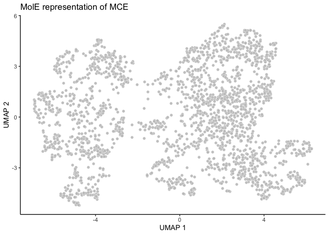
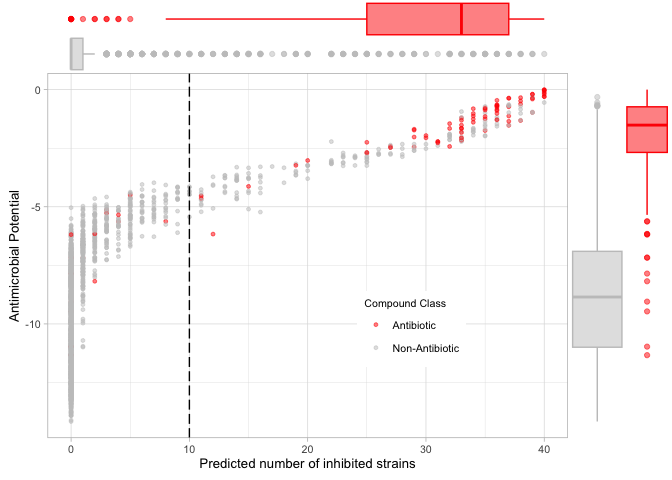
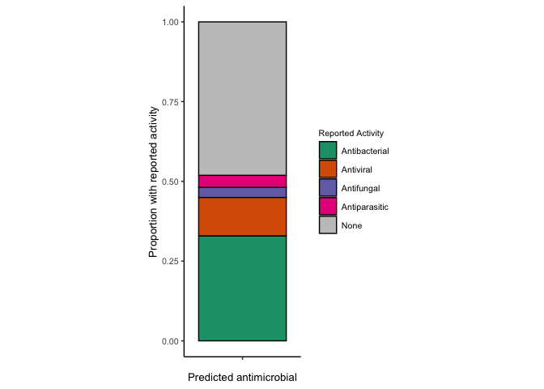

Analysing MolE predictions
================
Roberto Olayo Alarcon
27/03/2024

In this file we analyse the predictions made in the previous step. At
this point a literature search has been performed in order to validate
predictions

``` r
library(tidyverse)
library(ggrepel)
library(readxl)
library(uwot)
```

## Prepare directories.

``` r
PREDICTIONS_DIR <- "../data/04.new_predictions"
OUTPUT_DIR <- "../data/05.analyze_mce_predictions"

# Create output dir

if(!dir.exists(OUTPUT_DIR)){
  
  dir.create(OUTPUT_DIR)
  
}
```

## Library Representation.

In this section, we perform dimensionality reduction on the MolE
representation of the MedChemExpress library for which we make
predictions.

``` r
# Read Prediction Output
mole_predictions <- read_excel(file.path(PREDICTIONS_DIR, "mole_mce_predictions_litsearch.xlsx"), sheet = "mole_prediction_overview")

mole_predictions.over10 <- read_excel(file.path(PREDICTIONS_DIR, "mole_mce_predictions_litsearch.xlsx"), sheet = "mole_over10") %>% 
  mutate(`Reported Activity` = if_else(is.na(`Reported Activity`), "None", `Reported Activity`))


# Read the representation  
mole_representation <- vroom::vroom(file.path(PREDICTIONS_DIR, "MolE_representation_medchemexpress.tsv.gz"),
                                 show_col_types = FALSE) %>% 
  
  # Rename id column
  rename("Catalog Number" = "...1") %>% 
  
  # Filter for the molecules for which we make predictions
  filter(`Catalog Number` %in% mole_predictions$`Catalog Number`) %>% 
  
  # Set column to row.names
  column_to_rownames("Catalog Number")
```

    ## New names:
    ## • `` -> `...1`

### Preprocess representation.

Remove constant and correlated features

``` r
remove_constant <- function(m.df, var.cutoff){
  

  #' Removes constant columns from a data frame based on a variance threshold.
  #' 
  #' @param m.df A data frame. Input data frame.
  #' @param var.cutoff A numeric. Variance threshold. Columns with variance below this threshold will be removed.
  #' 
  #' @return A data frame. Data frame with constant columns removed.
  #' 
  #' @examples
  #' remove_constant(m.df = my_data_frame, var.cutoff = 0.01)
  #' 
  #' The function calculates the variance of each dimension in the input data frame. 
  #' It then identifies columns with variance above the specified threshold and removes constant columns. 
  #' The resulting data frame without constant columns is returned.
  #' 
  
  
  # Variance of each dimension
  var.feats <-  apply(m.df, 2, var)
  
  
  # Keep columns above variance thresh
  keep_cols <- names(var.feats[var.feats > var.cutoff])
  
  # Filter df
  m.var.df <- m.df %>% 
    select(all_of(as.character(keep_cols)))
  
  
  return(m.var.df)
}


remove_corfeats <- function(m.df, cor.thresh){
  #' Removes correlated features from a data frame based on a correlation threshold.
  #' 
  #' @param m.df A data frame. Input data frame.
  #' @param cor.thresh A numeric. Correlation threshold.
  #' 
  #' @return A data frame. Data frame with correlated features removed.
  #' 
  #' @examples
  #' remove_corfeats(m.df = my_data_frame, cor.thresh = 0.7)
  #' 
  #' The function calculates the correlation matrix of the input data frame. 
  #' It then identifies correlated columns based on the correlation threshold. 
  #' Columns with correlations above the threshold are removed. 
  #' The resulting data frame without correlated features is returned.
  #' 
  

  # Correlation Matrix
  cor.mat <-  cor(m.df)
  
  # Format triangle
  cor.mat[lower.tri(cor.mat, diag = TRUE)] <- 0
  
  # Find correlated columns
  corr.descision <- apply(cor.mat, 2, function(x){ifelse(any(x >= cor.thresh), "remove", "remain")})
  
  # Keep columns
  keep_cols <- names(corr.descision[corr.descision == "remain"])
  
  # Filter df
  
  m.uncor <- m.df %>% 
    select(all_of(keep_cols))
  
  
  return(m.uncor)
  
}

preprocess_mole <- function(mole_df, min.var, corr.thresh){
  #' Preprocesses molecular data by filtering out constant columns and correlated features.
  #' 
  #' @param mole_df A data frame. Input molecular data frame.
  #' @param min.var A numeric. Variance threshold for removing constant columns.
  #' @param corr.thresh A numeric. Correlation threshold for removing correlated features.
  #' 
  #' @return A data frame. Preprocessed molecular data frame.
  #' 
  #' @examples
  #' preprocess_mole(mole_df = my_molecular_data_frame, min.var = 0.01, corr.thresh = 0.7)
  #' 
  #' The function preprocesses molecular data by first removing constant columns using the specified variance threshold. 
  #' Then, it removes correlated features based on the correlation threshold. 
  #' The resulting data frame is the preprocessed molecular data with constant columns and correlated features removed.
  #' 
  
  
  # Filter variance
  mole.variable <- remove_constant(mole_df, min.var)
  
  
  # Filter correlated
  mole.decorrelated <- remove_corfeats(mole.variable, corr.thresh)
  
  
  return(mole.decorrelated)
  
  
}

# Prepare data

mole_prepared <- preprocess_mole(mole_representation, min.var=0.01, corr.thresh=0.90)
mole_prepared %>% dim()
```

    ## [1] 2324  448

### Peform UMAP reduction.

``` r
set.seed(1234)
mole.umap <- umap(X=mole_prepared,
                 n_neighbors = 25,
                 n_components = 2,
                 min_dist = 0.35, 
                 n_threads = 20,
                 metric="cosine")


mole.umap <- as.data.frame(mole.umap) %>% 
  rownames_to_column("catalog_number")
```

``` r
mole.umap %>% 
  
ggplot(aes(x=V1, y=V2)) +
 geom_point(alpha=0.9, color="white", fill="#C5C5C5",
             size=2, shape=21, stroke=0.2) +
  
  theme_classic() + 
  
  labs(x="UMAP 1", 
       y = "UMAP 2",
       title = "MolE representation of MCE")
```

<!-- -->

### Plotting predicted broad-spectrum.

``` r
# Add information of broad-spectrum activity
mole.umap <- mole.umap %>% 
  mutate(pred_activity = if_else(catalog_number %in% mole_predictions.over10$`Catalog Number`, "Antimicrobial", "Not Antimicrobial"))


# Plot 
m.umap.over10 <- ggplot(mole.umap, aes(x=V1, y=V2)) +
  
  geom_point(data=subset(mole.umap, pred_activity == "Not Antimicrobial"), aes(color="Not Antimicrobial"), size=1.5) +
  geom_point(data=subset(mole.umap, pred_activity == "Antimicrobial"), aes(color="Antimicrobial"), size=1.5) +
  
  scale_color_manual(values=c("Antimicrobial" = alpha("#DE1F84", 0.7), "Not Antimicrobial" = alpha("#C5C5C5", 0.7))) +
  
  theme_void() +
  #coord_fixed(ratio = 0.4) +
  
  theme(legend.position = "bottom",
    axis.ticks.x = element_blank(),
        axis.text.x = element_blank(),
        axis.ticks.y = element_blank(),
        axis.text.y = element_blank(),
        text=element_text(size=10),
        panel.background = element_rect(fill = "transparent", color=NA),
      plot.background = element_rect(fill = "transparent", colour = NA)) +
  
  labs(x="UMAP 1",
       y="UMAP 2",
       color="Predicted Activity")

m.umap.over10
```

<!-- -->

## Ranking molecule predictions.

Here we will create plots that compare the antimicrobial activity and
the number of predicted inhibited strains.

``` r
# Format labels
scatter.nkill.apscore <- mole_predictions %>% 
  mutate(antibiotic = if_else(antibiotic == "abx", "Antibiotic", "Non-Antibiotic")) %>% 

# Create plots
ggplot(aes(x=nk_total, y=apscore_total, color=antibiotic)) +
  geom_point(alpha=0.5, size=1) +
  
  scale_color_manual(breaks = c("Antibiotic", "Non-Antibiotic"),
                     values=c("red", "#C5C5C5")) +
  
  geom_vline(xintercept = 10, linetype="longdash") +
  
  theme_light() +
  labs(x="Predicted number of inhibited strains",
       y = "Antimicrobial Potential",
       color="Compound Class") +
  theme(legend.position = c(0.7, 0.3),
        text=element_text(size=10),
        legend.text = element_text(size=8),
        legend.title = element_text(size=8))
  

score.vs.nkill.marginal <- ggExtra::ggMarginal(scatter.nkill.apscore, type="boxplot", groupColour = TRUE, groupFill = TRUE)
score.vs.nkill.marginal
```

<!-- -->

## Comparing Gram stains.

Here we compare the antimicrobial potential scores for gram negatives
and gram positives.

``` r
# Selected chemicals
selected_chems <- c("Visomitin", 
               "Ebastine", 
               "Opicapone",
               "Cetrorelix (Acetate)",
               'Thymidine',
               "Elvitegravir")

# Uridine derivatives
uridin.deriv <- c("Uridine",
                  "Uridine 5'-monophosphate",
                  "5-Methyluridine",
                  "2'-Deoxyuridine",
                  "Doxifluridine")
  
# Other interests
other.interest <- c("Tannic acid",
                    "Teniposide")

# Format Product Names
selected.chemicals.data <- mole_predictions.over10 %>% 
  mutate(ProductName = if_else(ProductName %in% selected_chems, ProductName, ""),
         ProductName = if_else(ProductName == "Cetrorelix (Acetate)", "Cetrorelix", ProductName))

uridine.deriv.data <- mole_predictions.over10 %>% 
   mutate(ProductName = if_else(ProductName %in% uridin.deriv, ProductName, ""))

other.interest.data <- mole_predictions.over10 %>% 
   mutate(ProductName = if_else(ProductName %in% other.interest, ProductName, ""))


# Plot
mole_predictions.over10 %>% 
  
  # Only non-antibiotics
  filter(antibiotic == "not_abx") %>% 
  mutate(`Reported Activity` = if_else(`Reported Activity` %in% c("Antiplasmodium", "Insecticide"), "Antiparasitic", `Reported Activity`)) %>% 
  
  
  ggplot(aes(x=apscore_gnegative, y=apscore_gpositive, color=`Reported Activity`)) +
  
  # Basic aes
  geom_point(size=1) +
  geom_abline(linetype="longdash", alpha=0.25) +
  
  # Add names
  geom_text_repel(data = selected.chemicals.data, aes(x=apscore_gnegative, y=apscore_gpositive, label=ProductName), 
                  max.overlaps = Inf, size=2, min.segment.length = 0, color="black", box.padding = 0.7, point.padding = 0.2, fontface="bold",
                  nudge_x = if_else(selected.chemicals.data$ProductName %in% c("Cetrorelix", "Ebastine"), -1, 0)) +
  
  geom_text_repel(data = uridine.deriv.data, aes(x=apscore_gnegative, y=apscore_gpositive, label=ProductName), 
                  max.overlaps = Inf, size=1.8, min.segment.length = 0, color="black", box.padding = 0.7, point.padding = 0.2,
                  nudge_x = if_else(uridine.deriv.data$ProductName %in% c("Uridine"), -1, 0)) +
  
  geom_text_repel(data = other.interest.data, aes(x=apscore_gnegative, y=apscore_gpositive, label=ProductName), 
                  max.overlaps = Inf, size=1.8, min.segment.length = 0, color="black", box.padding = 0.7, point.padding = 0.2) +
  
  # Color by reported activity
  scale_color_manual(breaks = c("Antibacterial", "Antiviral", "Antifungal", "Antiparasitic", "None"),
                    values = c("#1b9e77", "#d95f02", "#7570b3", "#e7298a", "#C5C5C5")) +
  
  theme_light() +
  theme(legend.position = "bottom",
        text = element_text(size=10)) +
  labs(x = latex2exp::TeX("Antimicrobial Potential $G^-$"),
       y = latex2exp::TeX("Antimicrobial Potential $G^+$"))
```

<!-- -->

## Propotion with reported activity

``` r
# Get the activity counts
proportion.known.activity <- mole_predictions.over10 %>% 
  
  # Only consider non-antibiotics
  filter(antibiotic == "not_abx") %>% 
  
  # Consolidate antiparasitic category
  mutate(`Reported Activity` = if_else(`Reported Activity` %in% c("Antiplasmodium", "Insecticide"), "Antiparasitic", `Reported Activity`)) %>% 
  
  count(`Reported Activity`) %>% 
  
  mutate(`Reported Activity` = factor(`Reported Activity`, levels=c("None", "Antiparasitic", "Antifungal", "Antiviral","Antibacterial")),
         x=" ")


# Gather 
reported.g <- ggplot(proportion.known.activity, aes(x=n, y=x, fill=`Reported Activity`)) +
   geom_bar(position="fill", stat="identity", color="black") +
  scale_fill_manual(breaks = c("Antibacterial", "Antiviral", "Antifungal", "Antiparasitic", "None"),
                    values = c("#1b9e77", "#d95f02", "#7570b3", "#e7298a", "#C5C5C5")) +
  
  theme_classic() +
  
  coord_flip() +
  
  theme(text=element_text(size=10),
        legend.position = "right",
        aspect.ratio = 3,
        legend.text = element_text(size = 8),
        legend.title = element_text(size=8)) +
  labs(x="Proportion with reported activity", 
       y="Predicted antimicrobial", 
       fill = "Reported Activity")

reported.g
```

<!-- -->

## Session Info

``` r
sessionInfo()
```

    ## R version 4.2.0 (2022-04-22)
    ## Platform: x86_64-pc-linux-gnu (64-bit)
    ## Running under: Ubuntu 22.04.4 LTS
    ## 
    ## Matrix products: default
    ## BLAS:   /opt/bayresq.net/R/R-4.2.0/lib/R/lib/libRblas.so
    ## LAPACK: /opt/bayresq.net/R/R-4.2.0/lib/R/lib/libRlapack.so
    ## 
    ## locale:
    ##  [1] LC_CTYPE=C.UTF-8       LC_NUMERIC=C           LC_TIME=C.UTF-8       
    ##  [4] LC_COLLATE=C.UTF-8     LC_MONETARY=C.UTF-8    LC_MESSAGES=C.UTF-8   
    ##  [7] LC_PAPER=C.UTF-8       LC_NAME=C              LC_ADDRESS=C          
    ## [10] LC_TELEPHONE=C         LC_MEASUREMENT=C.UTF-8 LC_IDENTIFICATION=C   
    ## 
    ## attached base packages:
    ## [1] stats     graphics  grDevices utils     datasets  methods   base     
    ## 
    ## other attached packages:
    ##  [1] uwot_0.1.14     Matrix_1.6-1.1  readxl_1.4.3    ggrepel_0.9.3  
    ##  [5] lubridate_1.9.3 forcats_1.0.0   stringr_1.5.0   dplyr_1.1.3    
    ##  [9] purrr_1.0.2     readr_2.1.4     tidyr_1.3.0     tibble_3.2.1   
    ## [13] ggplot2_3.4.2   tidyverse_2.0.0
    ## 
    ## loaded via a namespace (and not attached):
    ##  [1] Rcpp_1.0.10       lattice_0.20-45   digest_0.6.33     utf8_1.2.3       
    ##  [5] mime_0.12         R6_2.5.1          cellranger_1.1.0  evaluate_0.22    
    ##  [9] highr_0.10        pillar_1.9.0      rlang_1.1.1       rstudioapi_0.15.0
    ## [13] irlba_2.3.5.1     miniUI_0.1.1.1    rmarkdown_2.21    labeling_0.4.2   
    ## [17] bit_4.0.5         munsell_0.5.0     shiny_1.7.4       compiler_4.2.0   
    ## [21] httpuv_1.6.9      xfun_0.40         pkgconfig_2.0.3   htmltools_0.5.5  
    ## [25] tidyselect_1.2.0  codetools_0.2-18  fansi_1.0.4       crayon_1.5.2     
    ## [29] tzdb_0.4.0        withr_2.5.0       later_1.3.1       grid_4.2.0       
    ## [33] xtable_1.8-4      gtable_0.3.4      lifecycle_1.0.3   magrittr_2.0.3   
    ## [37] scales_1.2.1      cli_3.6.1         stringi_1.7.12    vroom_1.6.1      
    ## [41] farver_2.1.1      promises_1.2.0.1  ellipsis_0.3.2    generics_0.1.3   
    ## [45] vctrs_0.6.3       latex2exp_0.9.6   RcppAnnoy_0.0.21  tools_4.2.0      
    ## [49] bit64_4.0.5       glue_1.6.2        hms_1.1.2         parallel_4.2.0   
    ## [53] fastmap_1.1.1     yaml_2.3.7        timechange_0.2.0  colorspace_2.1-0 
    ## [57] ggExtra_0.10.1    knitr_1.42
