Analysing MCE predictions
================
Roberto Olayo Alarcon
27/03/2024

In this file we analyse the predictions made in the previous step. At
this point a literature search has been performed in order to validate
predictions

``` r
library(tidyverse)
library(ggrepel)
library(readxl)
library(uwot)
```

## Prepare directories.

``` r
PREDICTIONS_DIR <- "../data/04.new_predictions"
OUTPUT_DIR <- "../data/05.analyze_mce_predictions"

# Create output dir

if(!dir.exists(OUTPUT_DIR)){
  
  dir.create(OUTPUT_DIR)
  
}
```

## Library Representation.

In this section, we perform dimensionality reduction on the MolE
representation of the MedChemExpress library for which we make
predictions.

``` r
# Read Prediction Output
mole_predictions <- read_excel(file.path(PREDICTIONS_DIR, "mole_mce_predictions_litsearch.xlsx"), sheet = "mole_prediction_overview")

mole_predictions.over10 <- read_excel(file.path(PREDICTIONS_DIR, "mole_mce_predictions_litsearch.xlsx"), sheet = "mole_over10") %>% 
  mutate(`Reported Activity` = if_else(is.na(`Reported Activity`), "None", `Reported Activity`))


# Read the representation  
mole_representation <- vroom::vroom(file.path(PREDICTIONS_DIR, "MolE_representation_medchemexpress.tsv.gz"),
                                 show_col_types = FALSE) %>% 
  
  # Rename id column
  rename("Catalog Number" = "...1") %>% 
  
  # Filter for the molecules for which we make predictions
  filter(`Catalog Number` %in% mole_predictions$`Catalog Number`) %>% 
  
  # Set column to row.names
  column_to_rownames("Catalog Number")
```

    ## New names:
    ## • `` -> `...1`

``` r
# Read Prediction Output
ecfp4_predictions <- read_excel(file.path(PREDICTIONS_DIR, "ecfp4_mce_predictions_litsearch.xlsx"), sheet = "ecfp4_prediction_overview")

ecfp4_predictions.over10 <- read_excel(file.path(PREDICTIONS_DIR, "ecfp4_mce_predictions_litsearch.xlsx"), sheet = "ecfp4_over10") %>% 
  mutate(`Reported Activity` = if_else(is.na(`Reported Activity`), "None", `Reported Activity`))


# Read the representation  
ecfp4_representation <- vroom::vroom(file.path(PREDICTIONS_DIR, "ecfp4_representation_medchemexpress.tsv.gz"),
                                 show_col_types = FALSE) %>% 
  
  # Rename id column
  rename("Catalog Number" = "...1") %>% 
  
  # Filter for the molecules for which we make predictions
  filter(`Catalog Number` %in% mole_predictions$`Catalog Number`) %>% 
  
  # Set column to row.names
  column_to_rownames("Catalog Number")
```

    ## New names:
    ## • `` -> `...1`

### Preprocess representation.

Remove constant and correlated features

``` r
remove_constant <- function(m.df, var.cutoff){
  

  #' Removes constant columns from a data frame based on a variance threshold.
  #' 
  #' @param m.df A data frame. Input data frame.
  #' @param var.cutoff A numeric. Variance threshold. Columns with variance below this threshold will be removed.
  #' 
  #' @return A data frame. Data frame with constant columns removed.
  #' 
  #' @examples
  #' remove_constant(m.df = my_data_frame, var.cutoff = 0.01)
  #' 
  #' The function calculates the variance of each dimension in the input data frame. 
  #' It then identifies columns with variance above the specified threshold and removes constant columns. 
  #' The resulting data frame without constant columns is returned.
  #' 
  
  
  # Variance of each dimension
  var.feats <-  apply(m.df, 2, var)
  
  
  # Keep columns above variance thresh
  keep_cols <- names(var.feats[var.feats > var.cutoff])
  
  # Filter df
  m.var.df <- m.df %>% 
    select(all_of(as.character(keep_cols)))
  
  
  return(m.var.df)
}


remove_corfeats <- function(m.df, cor.thresh){
  #' Removes correlated features from a data frame based on a correlation threshold.
  #' 
  #' @param m.df A data frame. Input data frame.
  #' @param cor.thresh A numeric. Correlation threshold.
  #' 
  #' @return A data frame. Data frame with correlated features removed.
  #' 
  #' @examples
  #' remove_corfeats(m.df = my_data_frame, cor.thresh = 0.7)
  #' 
  #' The function calculates the correlation matrix of the input data frame. 
  #' It then identifies correlated columns based on the correlation threshold. 
  #' Columns with correlations above the threshold are removed. 
  #' The resulting data frame without correlated features is returned.
  #' 
  

  # Correlation Matrix
  cor.mat <-  cor(m.df)
  
  # Format triangle
  cor.mat[lower.tri(cor.mat, diag = TRUE)] <- 0
  
  # Find correlated columns
  corr.descision <- apply(cor.mat, 2, function(x){ifelse(any(x >= cor.thresh), "remove", "remain")})
  
  # Keep columns
  keep_cols <- names(corr.descision[corr.descision == "remain"])
  
  # Filter df
  
  m.uncor <- m.df %>% 
    select(all_of(keep_cols))
  
  
  return(m.uncor)
  
}

preprocess_mole <- function(mole_df, min.var, corr.thresh){
  #' Preprocesses molecular data by filtering out constant columns and correlated features.
  #' 
  #' @param mole_df A data frame. Input molecular data frame.
  #' @param min.var A numeric. Variance threshold for removing constant columns.
  #' @param corr.thresh A numeric. Correlation threshold for removing correlated features.
  #' 
  #' @return A data frame. Preprocessed molecular data frame.
  #' 
  #' @examples
  #' preprocess_mole(mole_df = my_molecular_data_frame, min.var = 0.01, corr.thresh = 0.7)
  #' 
  #' The function preprocesses molecular data by first removing constant columns using the specified variance threshold. 
  #' Then, it removes correlated features based on the correlation threshold. 
  #' The resulting data frame is the preprocessed molecular data with constant columns and correlated features removed.
  #' 
  
  
  # Filter variance
  mole.variable <- remove_constant(mole_df, min.var)
  
  
  # Filter correlated
  mole.decorrelated <- remove_corfeats(mole.variable, corr.thresh)
  
  
  return(mole.decorrelated)
  
  
}

# Prepare data

mole_prepared <- preprocess_mole(mole_representation, min.var=0.01, corr.thresh=0.90)
mole_prepared %>% dim()
```

    ## [1] 2319  445

Similar procedure for ECFP4 representation

``` r
hamming <- function(X) {
    D <- (1 - X) %*% t(X)
    HamDist <- D + t(D)
    
    return(HamDist / ncol(X))
}

remove_rare <-  function(f.df, min_chems){
  
  # Removes columns where a feature is not present in the majority of compounds
  #   
  #   Parameters
  #   ----------
  #   - fdf: pandas dataframe. Columns are bits of the fingerprint. Rows are compounds
  #   - mc: int. The minimum number of molecules a feature should be present in order for it to be preserved
  
  
  # Number of chemicals a feature is present in
  n.freq <- colSums(f.df)
  names(n.freq) <- colnames(f.df)
  
  # Filter popular features
  common.features <- n.freq[n.freq >= min_chems]
  
  # Alter df
  
  f.common <- f.df %>% 
    select(all_of(names(common.features)))
  
  
  return(f.common)
}

remove_correlated <- function(f.df, min_dist){
  
  # Removes highly similar features
  # 
  #   Parameters
  #   ----------
  #   - fdf: pandas dataframe. Dataframe where columns are bits in the fingerprint
  #   - mdist: float. Is minimal distance between features in order to be different enough
  # 
  #   Returns
  #   -------
  #   pandas dataframe
  #   Highly correlated features are removed (one of them is preserved)
  
  # Hamming distance
  dist.matrix <-  hamming(t(f.df))
  
  # Format 
  dist.matrix[lower.tri(dist.matrix, diag = TRUE)] <- 1
  
  # Find correlated columns
  corr.descision <- apply(dist.matrix, 2, function(x){ifelse(any(x <= min_dist), "remove", "remain")})
  
  # Only keep un-correlated feats
  keep_cols <- names(corr.descision[corr.descision == "remain"])
  
  
  # Filter df
  f.uncorr <- f.df %>% 
    select(all_of(as.character(keep_cols)))
  
  
  return(f.uncorr)}


preprocess_fps <- function(fps_df, min_compounds, sim_threshold){
  

    # Processes a fingerprint dataframe. Removes rare and highly correlated features
    # 
    # Parameters
    # ----------
    # - fps_df: pandas dataframe. Dataframe where columns are bits in the fingerprint
    # - min_compounds: int. The minimum number of molecules a feature should be present in order for it to be preserved
    # - sim_threshold: float. Is minimal distance between features in order to be different enough
    
  
  fps_common <-  remove_rare(fps_df, min_compounds)
  
  fps.decorr <-  remove_correlated(fps_common, sim_threshold)
  
  return(fps.decorr)
}


ecfp4_prepared <- preprocess_fps(ecfp4_representation, 10, 0.01)
ecfp4_prepared %>% dim()
```

    ## [1] 2319  992

### Peform UMAP reduction.

``` r
set.seed(1234)
mole.umap <- umap(X=mole_prepared,
                 n_neighbors = 25,
                 n_components = 2,
                 min_dist = 0.35, 
                 n_threads = 20,
                 metric="cosine")


mole.umap <- as.data.frame(mole.umap) %>% 
  rownames_to_column("catalog_number")
```

``` r
mole.umap %>% 
  
ggplot(aes(x=V1, y=V2)) +
 geom_point(alpha=0.9, color="white", fill="#C5C5C5",
             size=2, shape=21, stroke=0.2) +
  
  theme_classic() + 
  
  labs(x="UMAP 1", 
       y = "UMAP 2",
       title = "MolE representation of MCE")
```

<!-- -->

``` r
# Jaccard distance
jac.dist <- dist(ecfp4_prepared, method = "binary")

set.seed(1234)
ecfp4.umap <- umap(X=jac.dist,
                 n_neighbors = 20,
                 n_components = 2,
                 min_dist = 0.3, 
                 n_threads = 20)


ecfp4.umap <- as.data.frame(ecfp4.umap) %>% 
  rownames_to_column("catalog_number")
```

``` r
ecfp4.umap %>% 
  
ggplot(aes(x=V1, y=V2)) +
 geom_point(alpha=0.9, color="white", fill="#C5C5C5",
             size=2, shape=21, stroke=0.2) +
  
  theme_classic() + 
  
  labs(x="UMAP 1", 
       y = "UMAP 2",
       title = "ECFP4 representation of MCE")
```

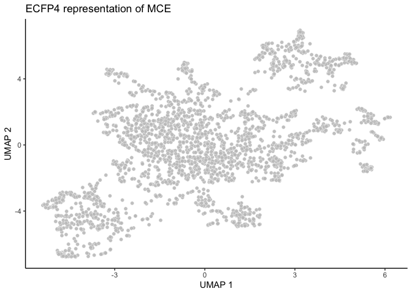<!-- -->

### Plotting predicted broad-spectrum.

``` r
# Add information of broad-spectrum activity
mole.umap <- mole.umap %>% 
  mutate(pred_activity = if_else(catalog_number %in% mole_predictions.over10$`Catalog Number`, "Antimicrobial", "Not Antimicrobial"))


# Plot 
m.umap.over10 <- ggplot(mole.umap, aes(x=V1, y=V2)) +
  
  geom_point(data=subset(mole.umap, pred_activity == "Not Antimicrobial"), aes(color="Not Antimicrobial"), size=1.5) +
  geom_point(data=subset(mole.umap, pred_activity == "Antimicrobial"), aes(color="Antimicrobial"), size=1.5) +
  
  scale_color_manual(values=c("Antimicrobial" = alpha("#DE1F84", 0.7), "Not Antimicrobial" = alpha("#C5C5C5", 0.7))) +
  
  theme_void() +
  #coord_fixed(ratio = 0.4) +
  
  theme(legend.position = "bottom",
    axis.ticks.x = element_blank(),
        axis.text.x = element_blank(),
        axis.ticks.y = element_blank(),
        axis.text.y = element_blank(),
        text=element_text(size=10),
        panel.background = element_rect(fill = "transparent", color=NA),
      plot.background = element_rect(fill = "transparent", colour = NA)) +
  
  labs(x="UMAP 1",
       y="UMAP 2",
       color="Predicted Activity")

m.umap.over10
```

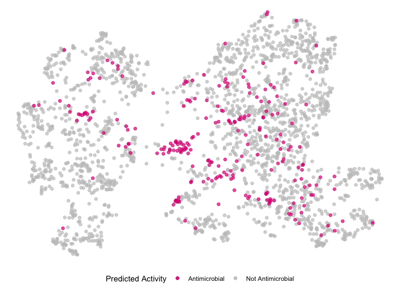<!-- -->

``` r
# Add information of broad-spectrum activity
ecfp4.umap <- ecfp4.umap %>% 
  mutate(pred_activity = if_else(catalog_number %in% mole_predictions.over10$`Catalog Number`, "Antimicrobial", "Not Antimicrobial"))


# Plot 
e.umap.over10 <- ggplot(ecfp4.umap, aes(x=V1, y=V2)) +
  
  geom_point(data=subset(ecfp4.umap, pred_activity == "Not Antimicrobial"), aes(color="Not Antimicrobial"), size=1.5) +
  geom_point(data=subset(ecfp4.umap, pred_activity == "Antimicrobial"), aes(color="Antimicrobial"), size=1.5) +
  
  scale_color_manual(values=c("Antimicrobial" = alpha("#DE1F84", 0.7), "Not Antimicrobial" = alpha("#C5C5C5", 0.7))) +
  
  theme_void() +
  #coord_fixed(ratio = 0.4) +
  
  theme(legend.position = "bottom",
    axis.ticks.x = element_blank(),
        axis.text.x = element_blank(),
        axis.ticks.y = element_blank(),
        axis.text.y = element_blank(),
        text=element_text(size=10),
        panel.background = element_rect(fill = "transparent", color=NA),
      plot.background = element_rect(fill = "transparent", colour = NA)) +
  
  labs(x="UMAP 1",
       y="UMAP 2",
       color="Predicted Activity")

e.umap.over10
```

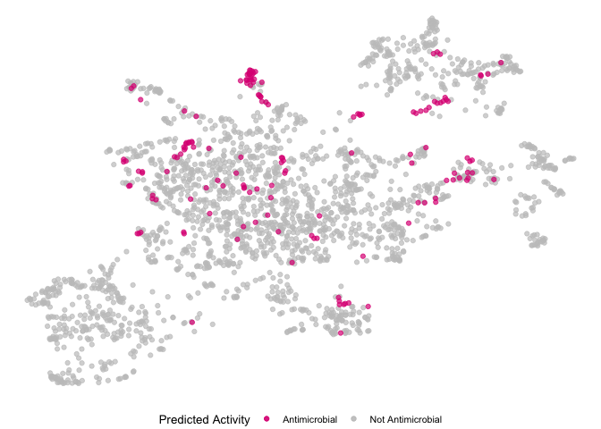<!-- -->

## Ranking molecule predictions.

Here we will create plots that compare the antimicrobial activity and
the number of predicted inhibited strains.

``` r
# Format labels
scatter.nkill.apscore <- mole_predictions %>% 
  mutate(antibiotic = if_else(antibiotic == "abx", "Antibiotic", "Non-Antibiotic")) %>% 

# Create plots
ggplot(aes(x=nk_total, y=apscore_total, color=antibiotic)) +
  geom_point(alpha=0.5, size=1) +
  
  scale_color_manual(breaks = c("Antibiotic", "Non-Antibiotic"),
                     values=c("red", "#C5C5C5")) +
  
  geom_vline(xintercept = 10, linetype="longdash") +
  
  theme_light() +
  labs(x="Predicted number of inhibited strains",
       y = "Antimicrobial Potential",
       color="Compound Class") +
  theme(legend.position = c(0.7, 0.3),
        text=element_text(size=10),
        legend.text = element_text(size=8),
        legend.title = element_text(size=8))
  

score.vs.nkill.marginal <- ggExtra::ggMarginal(scatter.nkill.apscore, type="boxplot", groupColour = TRUE, groupFill = TRUE)
score.vs.nkill.marginal
```

<!-- -->

``` r
# Format labels
scatter.nkill.apscore.e <- ecfp4_predictions %>% 
  mutate(antibiotic = if_else(antibiotic == "abx", "Antibiotic", "Non-Antibiotic")) %>% 

# Create plots
ggplot(aes(x=nk_total, y=apscore_total, color=antibiotic)) +
  geom_point(alpha=0.5, size=1) +
  
  scale_color_manual(breaks = c("Antibiotic", "Non-Antibiotic"),
                     values=c("red", "#C5C5C5")) +
  
  geom_vline(xintercept = 10, linetype="longdash") +
  
  theme_light() +
  labs(x="Predicted number of inhibited strains",
       y = "Antimicrobial Potential",
       color="Compound Class") +
  theme(legend.position = c(0.7, 0.3),
        text=element_text(size=10),
        legend.text = element_text(size=8),
        legend.title = element_text(size=8))
  

score.vs.nkill.marginal.e <- ggExtra::ggMarginal(scatter.nkill.apscore.e, type="boxplot", groupColour = TRUE, groupFill = TRUE)
score.vs.nkill.marginal.e
```

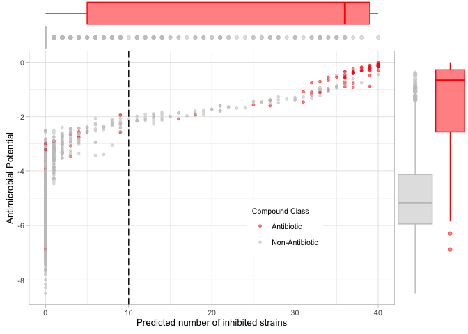<!-- -->

## Comparing Gram stains.

Here we compare the antimicrobial potential scores for gram negatives
and gram positives.

``` r
# Selected chemicals
selected_chems <- c("Visomitin", 
               "Ebastine", 
               "Opicapone",
               "Cetrorelix (Acetate)",
               'Thymidine',
               "Elvitegravir")

# Uridine derivatives
uridin.deriv <- c("Uridine",
                  "Uridine 5'-monophosphate",
                  "5-Methyluridine",
                  "2'-Deoxyuridine",
                  "Doxifluridine")
  
# Other interests
# Other interests
other.interest <- c("Tannic acid",
                    "Teniposide",
                    "Mequitazine",
                    "Dimetridazole",
                    "Azelnipidine",
                    "Luliconazole",
                    "Bergenin")


# Format Product Names
selected.chemicals.data <- mole_predictions.over10 %>% 
  mutate(ProductName = if_else(ProductName %in% selected_chems, ProductName, ""),
         ProductName = if_else(ProductName == "Cetrorelix (Acetate)", "Cetrorelix", ProductName))

uridine.deriv.data <- mole_predictions.over10 %>% 
   mutate(ProductName = if_else(ProductName %in% uridin.deriv, ProductName, ""))

other.interest.data <- mole_predictions.over10 %>% 
   mutate(ProductName = if_else(ProductName %in% other.interest, ProductName, ""))


# Plot
predBS.mole <- mole_predictions.over10 %>% 
  
  # Only non-antibiotics
  filter(antibiotic == "not_abx") %>% 
  mutate(`Reported Activity` = if_else(`Reported Activity` %in% c("Antiplasmodium", "Insecticide"), "Antiparasitic", `Reported Activity`)) %>% 
  
  
  ggplot(aes(x=apscore_gnegative, y=apscore_gpositive, color=`Reported Activity`)) +
  
  # Basic aes
  geom_point(size=1) +
  geom_abline(linetype="longdash", alpha=0.25) +
  
  # Add names
  geom_text_repel(data = selected.chemicals.data, aes(x=apscore_gnegative, y=apscore_gpositive, label=ProductName), 
                  max.overlaps = Inf, size=2, min.segment.length = 0, color="black", box.padding = 0.7, point.padding = 0.2, fontface="bold",
                  nudge_x = if_else(selected.chemicals.data$ProductName %in% c("Cetrorelix", "Ebastine"), -1, 0)) +
  
  geom_text_repel(data = uridine.deriv.data, aes(x=apscore_gnegative, y=apscore_gpositive, label=ProductName), 
                  max.overlaps = Inf, size=1.8, min.segment.length = 0, color="black", box.padding = 0.7, point.padding = 0.2,
                  nudge_x = if_else(uridine.deriv.data$ProductName %in% c("Uridine"), -1, 0)) +
  
  geom_text_repel(data = other.interest.data, aes(x=apscore_gnegative, y=apscore_gpositive, label=ProductName), 
                  max.overlaps = Inf, size=1.8, min.segment.length = 0, color="black", box.padding = 0.7, point.padding = 0.2) +
  
  # Color by reported activity
  scale_color_manual(breaks = c("Antibacterial", "Antiviral", "Antifungal", "Antiparasitic", "None"),
                    values = c("#1b9e77", "#d95f02", "#7570b3", "#e7298a", "#C5C5C5")) +
  
  theme_light() +
  theme(legend.position = "bottom",
        text = element_text(size=10)) +
  labs(x = latex2exp::TeX("Antimicrobial Potential $G^-$"),
       y = latex2exp::TeX("Antimicrobial Potential $G^+$"))
  
predBS.mole
```

<!-- -->

``` r
# Selected chemicals
selected_chems <- c("Visomitin", 
               "Ebastine", 
               "Opicapone",
               "Cetrorelix (Acetate)",
               'Thymidine',
               "Elvitegravir")

# Uridine derivatives
uridin.deriv <- c("Uridine",
                  "Uridine 5'-monophosphate",
                  "5-Methyluridine",
                  "2'-Deoxyuridine",
                  "Doxifluridine")
  
# Other interests
other.interest <- c("Tannic acid",
                    "Teniposide",
                    "Dimetridazole",
                    "Azelnipidine",
                    "Luliconazole",
                    "Bergenin")


# Format Product Names
selected.chemicals.data <- ecfp4_predictions.over10 %>% 
  mutate(ProductName = if_else(ProductName %in% selected_chems, ProductName, ""),
         ProductName = if_else(ProductName == "Cetrorelix (Acetate)", "Cetrorelix", ProductName))

uridine.deriv.data <- ecfp4_predictions.over10 %>% 
   mutate(ProductName = if_else(ProductName %in% uridin.deriv, ProductName, ""))

other.interest.data <- ecfp4_predictions.over10 %>% 
   mutate(ProductName = if_else(ProductName %in% other.interest, ProductName, ""))

# Plot
predBS.fps <- ecfp4_predictions.over10 %>% 
  
  # Only non-antibiotics
  filter(antibiotic == "not_abx") %>% 
  mutate(`Reported Activity` = if_else(`Reported Activity` %in% c("Antiplasmodium", "Insecticide"), "Antiparasitic", `Reported Activity`)) %>% 
  
  
  ggplot(aes(x=apscore_gnegative, y=apscore_gpositive, color=`Reported Activity`)) +
  
  # Basic aes
  geom_point(size=1) +
  geom_abline(linetype="longdash", alpha=0.25) +
  
  # Add names
  geom_text_repel(data = selected.chemicals.data, aes(x=apscore_gnegative, y=apscore_gpositive, label=ProductName), 
                  max.overlaps = Inf, size=2, min.segment.length = 0, color="black", box.padding = 0.7, point.padding = 0.2, fontface="bold",
                  nudge_x = if_else(selected.chemicals.data$ProductName %in% c("Cetrorelix", "Ebastine"), -1, 0)) +
  
  geom_text_repel(data = uridine.deriv.data, aes(x=apscore_gnegative, y=apscore_gpositive, label=ProductName), 
                  max.overlaps = Inf, size=1.8, min.segment.length = 0, color="black", box.padding = 0.7, point.padding = 0.2,
                  nudge_x = if_else(uridine.deriv.data$ProductName %in% c("Uridine"), -1, 0)) +
  
  geom_text_repel(data = other.interest.data, aes(x=apscore_gnegative, y=apscore_gpositive, label=ProductName), 
                  max.overlaps = Inf, size=1.8, min.segment.length = 0, color="black", box.padding = 0.7, point.padding = 0.2) +
  
  # Color by reported activity
  scale_color_manual(breaks = c("Antibacterial", "Antiviral", "Antifungal", "Antiparasitic", "None"),
                    values = c("#1b9e77", "#d95f02", "#7570b3", "#e7298a", "#C5C5C5")) +
  
  theme_light() +
  theme(legend.position = "bottom",
        text = element_text(size=10)) +
  labs(x = latex2exp::TeX("Antimicrobial Potential $G^-$"),
       y = latex2exp::TeX("Antimicrobial Potential $G^+$"))

predBS.fps
```

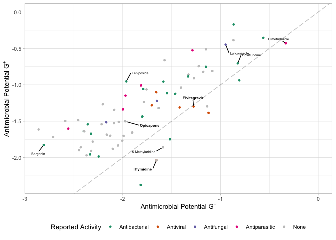<!-- -->

## Propotion with reported activity

``` r
# Get the activity counts
proportion.known.activity <- mole_predictions.over10 %>% 
  
  # Only consider non-antibiotics
  filter(antibiotic == "not_abx") %>% 
  
  # Consolidate antiparasitic category
  mutate(`Reported Activity` = if_else(`Reported Activity` %in% c("Antiplasmodium", "Insecticide"), "Antiparasitic", `Reported Activity`)) %>% 
  
  count(`Reported Activity`) %>% 
  
  mutate(`Reported Activity` = factor(`Reported Activity`, levels=c("None", "Antiparasitic", "Antifungal", "Antiviral","Antibacterial")),
         x=" ")


# Gather 
reported.g <- ggplot(proportion.known.activity, aes(x=n, y=x, fill=`Reported Activity`)) +
   geom_bar(position="fill", stat="identity", color="black") +
  scale_fill_manual(breaks = c("Antibacterial", "Antiviral", "Antifungal", "Antiparasitic", "None"),
                    values = c("#1b9e77", "#d95f02", "#7570b3", "#e7298a", "#C5C5C5")) +
  
  theme_classic() +
  
  coord_flip() +
  
  theme(text=element_text(size=10),
        legend.position = "right",
        aspect.ratio = 3,
        legend.text = element_text(size = 8),
        legend.title = element_text(size=8)) +
  labs(x="Proportion with reported activity", 
       y="Predicted antimicrobial", 
       fill = "Reported Activity")

reported.g
```

<!-- -->

``` r
# Get the activity counts
proportion.known.activity.e <- ecfp4_predictions.over10 %>% 
  
  # Only consider non-antibiotics
  filter(antibiotic == "not_abx") %>% 
  
  # Consolidate antiparasitic category
  mutate(`Reported Activity` = if_else(`Reported Activity` %in% c("Antiplasmodium", "Insecticide"), "Antiparasitic", `Reported Activity`)) %>% 
  
  count(`Reported Activity`) %>% 
  
  mutate(`Reported Activity` = factor(`Reported Activity`, levels=c("None", "Antiparasitic", "Antifungal", "Antiviral","Antibacterial")),
         x=" ")


# Gather 
reported.g.e <- ggplot(proportion.known.activity.e, aes(x=n, y=x, fill=`Reported Activity`)) +
   geom_bar(position="fill", stat="identity", color="black") +
  scale_fill_manual(breaks = c("Antibacterial", "Antiviral", "Antifungal", "Antiparasitic", "None"),
                    values = c("#1b9e77", "#d95f02", "#7570b3", "#e7298a", "#C5C5C5")) +
  
  theme_classic() +
  
  coord_flip() +
  
  theme(text=element_text(size=10),
        legend.position = "right",
        aspect.ratio = 3,
        legend.text = element_text(size = 8),
        legend.title = element_text(size=8)) +
  labs(x="Proportion with reported activity", 
       y="Predicted antimicrobial", 
       fill = "Reported Activity")

reported.g.e
```

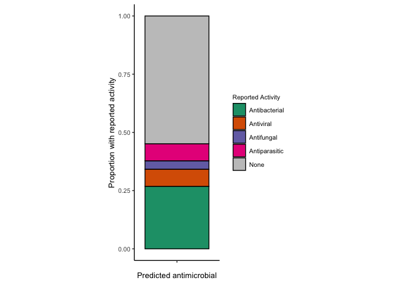<!-- -->

## Comparing MolE and ECFP4 predictions.

``` r
mole_complete_comp <- mole_predictions %>% 
  select(`Catalog Number`, nk_total, apscore_total, antibiotic, ProductName) %>% 
  rename("mole_nk_total" = "nk_total",
         "mole_apscore_total" = "apscore_total")


ecfp4_complete_comp <- ecfp4_predictions %>% 
  select(`Catalog Number`, nk_total, apscore_total) %>% 
  rename("ecfp4_nk_total" = "nk_total",
         "ecfp4_apscore_total" = "apscore_total")


complete_pred_comparison <- ecfp4_complete_comp %>% 
  left_join(mole_complete_comp, by='Catalog Number') %>% 
   mutate(antibiotic = if_else(antibiotic == "abx", "Antibiotic", "Non-Antibiotic"))


ap_comparison <- ggplot(complete_pred_comparison, aes(x=mole_apscore_total, y=ecfp4_apscore_total, color=antibiotic)) +
  
  geom_point(alpha=0.5, size=1) +
  geom_abline(linetype="longdash", alpha=0.5, color="blue") +
  
  scale_color_manual(breaks = c("Antibiotic", "Non-Antibiotic"),
                     values=c("red", "#C5C5C5")) +
  
  theme_light() +
  tune::coord_obs_pred() +
  
  #geom_smooth(method="lm", aes(color=NULL), formula=y~x) +
  
  labs(x="MolE AP",
       y="ECFP4 AP",
       color="Compound Class") +
  
  theme(legend.position = "none",
        text=element_text(size=10),
        legend.text = element_text(size=8),
        legend.title = element_text(size=8))


ap_comparison.marginal <- ggExtra::ggMarginal(ap_comparison, type="boxplot", groupColour = TRUE, groupFill = TRUE)
ap_comparison.marginal
```

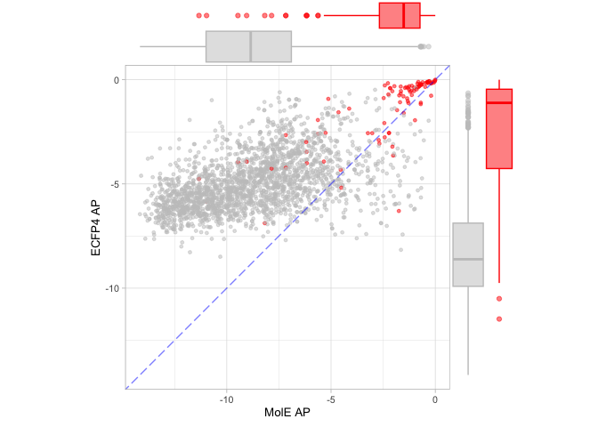<!-- -->

``` r
ggplot(complete_pred_comparison, aes(x=mole_nk_total, y=ecfp4_nk_total, color=antibiotic)) +
  
  geom_point(alpha=0.5, size=1) +
  geom_abline(linetype="longdash", alpha=0.5, color="blue") +
  
  geom_vline(xintercept = 10,linetype="longdash", alpha=0.5, color="black") +
  geom_hline(yintercept = 10,linetype="longdash", alpha=0.5, color="black") +
  
  scale_color_manual(breaks = c("Antibiotic", "Non-Antibiotic"),
                     values=c("red", "#C5C5C5")) +
  
  theme_light() +
  
  labs(title="Predicted number of inhibited strains comparison",
       x="MolE",
       y="ECFP4",
       color="Compound Class") +
  
  theme(text=element_text(size=10),
        legend.text = element_text(size=8),
        legend.title = element_text(size=8))
```

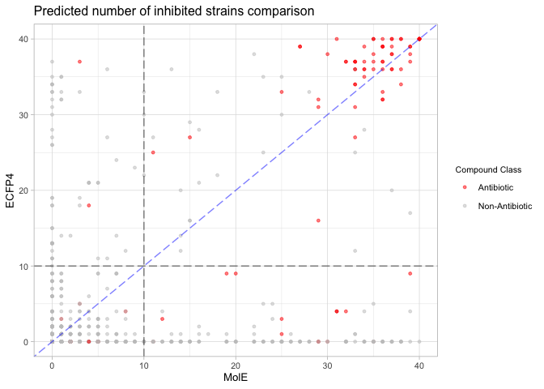<!-- -->

Comparing predicted broad spectrum compounds.

``` r
library(ggvenn)
```

    ## Loading required package: grid

``` r
fsize <- 3.5

# Complete comparison of broad spectrum antimicrobials
broad.list <- list("MolE" = mole_predictions.over10$`Catalog Number`,
                   "ECFP4" = ecfp4_predictions.over10$`Catalog Number`)

venn.abx.comparison <- ggvenn(broad.list,
       fill_color = c("#DE1F84", "#1F9DBB"),
       set_name_size=fsize,
       text_size=fsize)

venn.abx.comparison
```

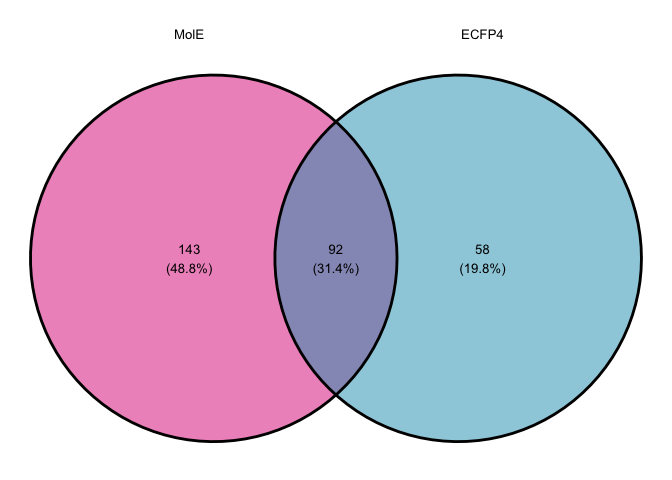<!-- -->

``` r
# Comparison of broad spectrum antimicrobials no antibiotics
broad.list <- list("MolE" = mole_predictions.over10 %>% filter(antibiotic == "not_abx") %>% select(`Catalog Number`) %>% unlist(),
                   "ECFP4" = ecfp4_predictions.over10 %>% filter(antibiotic == "not_abx") %>% select(`Catalog Number`) %>% unlist())

venn.nonabx.comparison <- ggvenn(broad.list,
       fill_color = c("#DE1F84", "#1F9DBB"),
       set_name_size=fsize,
       text_size=fsize)
```

Now compare results from literature search.

``` r
proportion.known.activity <- proportion.known.activity %>% 
  mutate(representation = "MolE")


proportion.known.activity.e <- proportion.known.activity.e %>% 
  mutate(representation = "ECFP4")

proportion.comparison <- bind_rows(proportion.known.activity, 
                                   proportion.known.activity.e)


reported.bar.comparison <- ggplot(proportion.comparison, aes(x=n, y=representation, fill=`Reported Activity`)) +
  
   geom_bar(position="fill", stat="identity", color="black") +
  scale_fill_manual(breaks = c("Antibacterial", "Antiviral", "Antifungal", "Antiparasitic", "None"),
                    values = c("#1b9e77", "#d95f02", "#7570b3", "#e7298a", "#C5C5C5")) +
  
  theme_classic() +
  
  coord_flip() +
  
  theme(text=element_text(size=10),
        legend.position = "right",
        aspect.ratio = 2,
        legend.text = element_text(size = 8),
        legend.title = element_text(size=8)) +
  
  
  labs(y="", 
       x="Proportion", 
       fill = "Reported Activity")

reported.bar.comparison
```

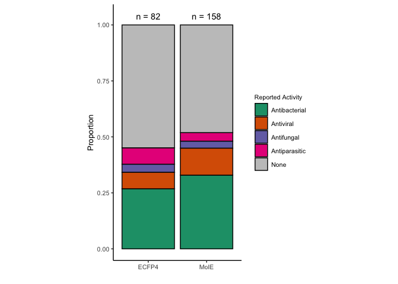<!-- -->

``` r
mole.o10.abx <- mole_predictions.over10 %>% 
  count(antibiotic) %>% 
  mutate(representation = "MolE")

ecfp4.o10.abx <- ecfp4_predictions.over10 %>% 
  count(antibiotic) %>% 
  mutate(representation = "ECFP4")
  

over10.abx <- bind_rows(mole.o10.abx, ecfp4.o10.abx) %>% 
  mutate(antibiotic = if_else(antibiotic == "abx", "Antibiotic", "Other"),
         antibiotic = factor(antibiotic, levels=c("Other", "Antibiotic")))


abx.bar.comparison <- ggplot(over10.abx, aes(x=n, y=representation, fill=antibiotic)) +
  
   geom_bar(position="fill", stat="identity", color="black") +
  scale_fill_manual(breaks = c("Other", "Antibiotic"),
                    values = c("#C5C5C5", "red")) +
  
  theme_classic() +
  
  coord_flip() +
  
  theme(text=element_text(size=10),
        legend.position = "right",
        aspect.ratio = 2,
        legend.text = element_text(size = 8),
        legend.title = element_text(size=8)) +
  
  
  labs(y="", 
       x="Proportion", 
       fill = "Compound Class")

abx.bar.comparison
```

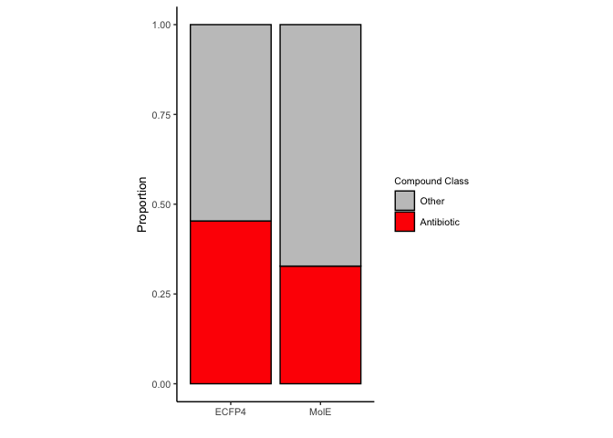<!-- -->

Comparing predicted broad spectrum.

``` r
mole.litsearch <- mole_predictions.over10 %>% 
  filter(antibiotic == "not_abx") %>% 
  select(`Catalog Number`, `Reported Activity`, ProductName) %>% 
  
  # Consolidate antiparasitic category
  mutate(`Reported Activity` = if_else(`Reported Activity` %in% c("Antiplasmodium", "Insecticide"), "Antiparasitic", `Reported Activity`))


ecfp4.litsearch <- ecfp4_predictions.over10 %>% 
  filter(antibiotic == "not_abx") %>% 
  select(`Catalog Number`, `Reported Activity`, ProductName) %>% 
  
  # Consolidate antiparasitic category
  mutate(`Reported Activity` = if_else(`Reported Activity` %in% c("Antiplasmodium", "Insecticide"), "Antiparasitic", `Reported Activity`))


combined.litsearch <- bind_rows(mole.litsearch, ecfp4.litsearch) %>% 
  distinct()


mole_o10 <- mole_predictions %>% 
  filter(`Catalog Number` %in% combined.litsearch$`Catalog Number`) %>% 
  select(`Catalog Number`, nk_total, apscore_total) %>% 
  
   rename("mole_nk_total" = "nk_total",
         "mole_apscore_total" = "apscore_total")


ecfp4_o10 <- ecfp4_predictions %>% 
  filter(`Catalog Number` %in% combined.litsearch$`Catalog Number`) %>% 
  select(`Catalog Number`, nk_total, apscore_total) %>% 
  
   rename("ecfp4_nk_total" = "nk_total",
         "ecfp4_apscore_total" = "apscore_total")


broadS.comp <- combined.litsearch %>% 
  left_join(mole_o10, by="Catalog Number") %>% 
  left_join(ecfp4_o10, by="Catalog Number")
```

``` r
# Selected chemicals
selected_chems <- c("Visomitin", 
               "Ebastine", 
               "Opicapone",
               "Cetrorelix (Acetate)",
               'Thymidine',
               "Elvitegravir")
  
# Other interests
other.interest <- c("Bergenin",
                    "Fenticonazole (Nitrate)",
                    "Doxifluridine",
                    "Broxyquinoline",
                    "Triclabendazole",
                    "Octenidine (dihydrochloride)",
                    "Benzalkonium (chloride)",
                    "Simeprevir")


# Format Product Names
selected.chemicals.data <- broadS.comp %>% 
  mutate(ProductName = if_else(ProductName %in% selected_chems, ProductName, ""),
         ProductName = if_else(ProductName == "Cetrorelix (Acetate)", "Cetrorelix", ProductName))

other.interest.data <- broadS.comp %>% 
   mutate(ProductName = if_else(ProductName %in% other.interest, ProductName, ""),
          ProductName = if_else(ProductName == "Fenticonazole (Nitrate)", "Fenticonazole", ProductName),
          ProductName = if_else(ProductName == "Octenidine (dihydrochloride)", "Octenidine", ProductName),
          ProductName = if_else(ProductName == "Benzalkonium (chloride)", "Benzalkonium", ProductName))


nk.comparison <- ggplot(broadS.comp, aes(x=mole_nk_total, y=ecfp4_nk_total, color=`Reported Activity`))  +
  
  geom_vline(xintercept = 10, linetype="longdash", color="black", alpha=0.5) +
  geom_hline(yintercept=10, linetype="longdash", color="black", alpha=0.5) + 
  
  geom_point(alpha=0.5) +
  geom_abline(linetype="longdash", color="red", alpha=0.5) +

   # Add names
  geom_text_repel(data = selected.chemicals.data, aes(x=mole_nk_total, y=ecfp4_nk_total, label=ProductName), 
                  max.overlaps = Inf, size=2, min.segment.length = 0, color="black", box.padding = 0.7, point.padding = 0.2, fontface="bold",
                  nudge_x = if_else(selected.chemicals.data$ProductName %in% c("Cetrorelix", "Ebastine"), -1, 0)) +
  
  geom_text_repel(data = other.interest.data, aes(x=mole_nk_total, y=ecfp4_nk_total, label=ProductName), 
                  max.overlaps = Inf, size=2, min.segment.length = 0, color="black", box.padding = 0.7, point.padding = 0.2) +
  
  
  
  scale_color_manual(breaks = c("Antibacterial", "Antiviral", "Antifungal", "Antiparasitic", "None"),
                    values = c("#1b9e77", "#d95f02", "#7570b3", "#e7298a", "#C5C5C5")) +
  
  theme_light() +
  
  labs(x="MolE - N. inhibited strains",
       y="ECFP4 - N. inhibited strains")

nk.comparison
```

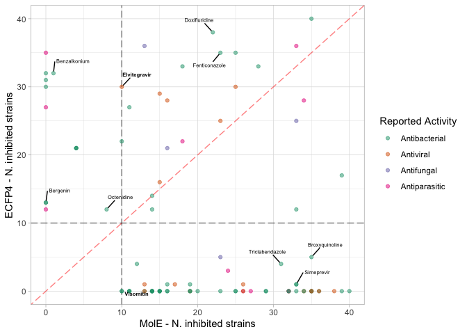<!-- -->

## Figure panels.

``` r
library(ggpubr)
```

``` r
top_row <- ggarrange(e.umap.over10 + theme(aspect.ratio = 0.4), reported.g.e, labels = c("a", "b"), 
          widths = c(2, 1),font.label = list(face="plain"))

bottom_row <- ggarrange(score.vs.nkill.marginal.e, predBS.fps + theme(legend.position = "none"),
          labels = c("c", "d"), font.label = list(face="plain"))

pred.fps.panel <- ggarrange(top_row, bottom_row, ncol = 1, nrow = 2, heights = c(0.8, 1))
pred.fps.panel
```

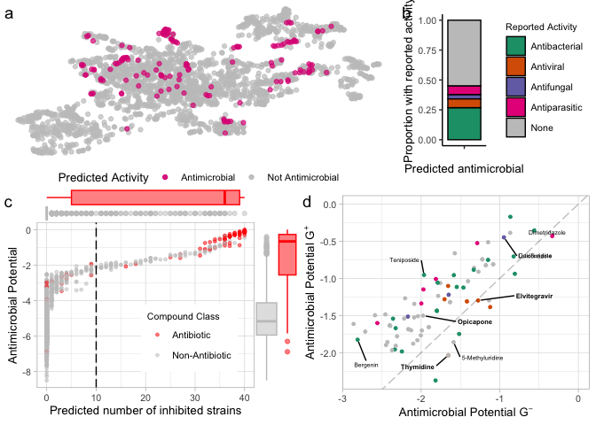<!-- -->

``` r
ggsave(filename = "../data/05.analyze_mce_predictions/ecfp4_mce_overview.pdf", 
       plot=pred.fps.panel,
       width = 21, height = 15, units="cm", dpi=300)
```

``` r
top_row <- ggarrange(m.umap.over10 + theme(aspect.ratio = 0.4), reported.g, labels = c("a", "b"), 
          widths = c(2, 1),font.label = list(face="plain"))

bottom_row <- ggarrange(score.vs.nkill.marginal, predBS.mole + theme(legend.position = "none"),
          labels = c("c", "d"), font.label = list(face="plain"))

pred.mole.panel <- ggarrange(top_row, bottom_row, ncol = 1, nrow = 2, heights = c(0.8, 1))
pred.mole.panel
```

<!-- -->

``` r
ggsave(filename = "../data/05.analyze_mce_predictions/mole_mce_overview.pdf", 
       plot=pred.mole.panel,
       width = 21, height = 15, units="cm", dpi=300)
```

## Model comparison.

``` r
top_row <- ggarrange(ap_comparison.marginal, 
                     nk.comparison + theme(legend.position = "none"),
                     labels = c("a", "b"), 
                     font.label = list(face="plain"))


bar.grid <- ggarrange(abx.bar.comparison, 
                      reported.bar.comparison, 
                      labels = c("c", "d"),
                      font.label = list(face="plain")) 

venn.panel <- ggarrange(venn.abx.comparison, venn.nonabx.comparison,
          labels = c("e", "f"),
          font.label = list(face="plain"))


comparison.panel <- ggarrange(top_row,
                              bar.grid, 
                              venn.panel,
                              ncol = 1, 
                              nrow = 3)

comparison.panel
```

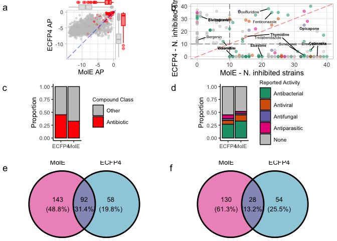<!-- -->

``` r
ggsave(filename = "../data/05.analyze_mce_predictions/mce_pred_comparison.pdf",
       plot=comparison.panel,
       width = 21, height = 29, units="cm", dpi=300)
```

## Session Info

``` r
sessionInfo()
```

    ## R version 4.3.1 (2023-06-16)
    ## Platform: x86_64-apple-darwin20 (64-bit)
    ## Running under: macOS Ventura 13.4.1
    ## 
    ## Matrix products: default
    ## BLAS:   /Library/Frameworks/R.framework/Versions/4.3-x86_64/Resources/lib/libRblas.0.dylib 
    ## LAPACK: /Library/Frameworks/R.framework/Versions/4.3-x86_64/Resources/lib/libRlapack.dylib;  LAPACK version 3.11.0
    ## 
    ## locale:
    ## [1] en_US.UTF-8/en_US.UTF-8/en_US.UTF-8/C/en_US.UTF-8/en_US.UTF-8
    ## 
    ## time zone: Europe/Berlin
    ## tzcode source: internal
    ## 
    ## attached base packages:
    ## [1] grid      stats     graphics  grDevices utils     datasets  methods  
    ## [8] base     
    ## 
    ## other attached packages:
    ##  [1] ggpubr_0.6.0    ggvenn_0.1.10   uwot_0.1.16     Matrix_1.6-1.1 
    ##  [5] readxl_1.4.2    ggrepel_0.9.3   lubridate_1.9.2 forcats_1.0.0  
    ##  [9] stringr_1.5.0   dplyr_1.1.2     purrr_1.0.2     readr_2.1.4    
    ## [13] tidyr_1.3.0     tibble_3.2.1    ggplot2_3.4.4   tidyverse_2.0.0
    ## 
    ## loaded via a namespace (and not attached):
    ##  [1] rlang_1.1.4         magrittr_2.0.3      furrr_0.3.1        
    ##  [4] RcppAnnoy_0.0.21    compiler_4.3.1      systemfonts_1.0.4  
    ##  [7] vctrs_0.6.5         lhs_1.1.6           tune_1.1.1         
    ## [10] pkgconfig_2.0.3     crayon_1.5.2        fastmap_1.1.1      
    ## [13] backports_1.4.1     ellipsis_0.3.2      labeling_0.4.3     
    ## [16] utf8_1.2.4          promises_1.2.0.1    rmarkdown_2.24     
    ## [19] prodlim_2023.03.31  tzdb_0.4.0          ragg_1.2.5         
    ## [22] bit_4.0.5           xfun_0.40           recipes_1.0.6      
    ## [25] highr_0.10          later_1.3.1         broom_1.0.5        
    ## [28] irlba_2.3.5.1       parallel_4.3.1      R6_2.5.1           
    ## [31] rsample_1.1.1       stringi_1.7.12      car_3.1-2          
    ## [34] parallelly_1.36.0   rpart_4.1.19        cellranger_1.1.0   
    ## [37] Rcpp_1.0.13         dials_1.2.0         iterators_1.0.14   
    ## [40] knitr_1.43          future.apply_1.11.0 httpuv_1.6.11      
    ## [43] splines_4.3.1       nnet_7.3-19         timechange_0.2.0   
    ## [46] tidyselect_1.2.0    abind_1.4-5         rstudioapi_0.15.0  
    ## [49] yaml_2.3.7          timeDate_4022.108   codetools_0.2-19   
    ## [52] miniUI_0.1.1.1      listenv_0.9.0       lattice_0.21-8     
    ## [55] shiny_1.7.4         withr_2.5.2         evaluate_0.21      
    ## [58] future_1.33.0       survival_3.5-5      pillar_1.9.0       
    ## [61] carData_3.0-5       foreach_1.5.2       generics_0.1.3     
    ## [64] vroom_1.6.3         hms_1.1.3           munsell_0.5.0      
    ## [67] scales_1.3.0        globals_0.16.2      xtable_1.8-4       
    ## [70] class_7.3-22        glue_1.7.0          tools_4.3.1        
    ## [73] data.table_1.14.8   ggsignif_0.6.4      gower_1.0.1        
    ## [76] cowplot_1.1.1       yardstick_1.2.0     ipred_0.9-14       
    ## [79] colorspace_2.1-0    cli_3.6.3           DiceDesign_1.9     
    ## [82] latex2exp_0.9.6     textshaping_0.3.6   workflows_1.1.3    
    ## [85] parsnip_1.1.0       fansi_1.0.6         lava_1.7.2.1       
    ## [88] gtable_0.3.4        rstatix_0.7.2       GPfit_1.0-8        
    ## [91] digest_0.6.33       farver_2.1.1        htmltools_0.5.6    
    ## [94] lifecycle_1.0.4     hardhat_1.3.0       mime_0.12          
    ## [97] ggExtra_0.10.0      bit64_4.0.5         MASS_7.3-60
